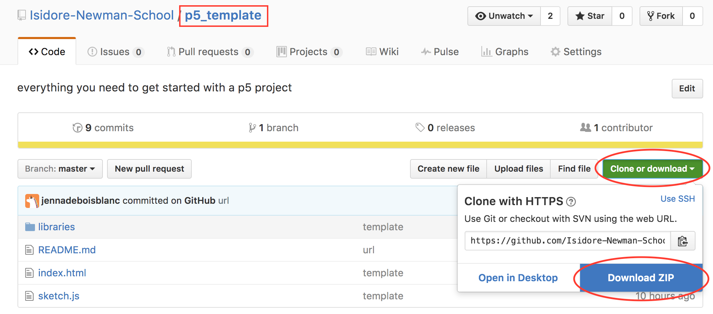
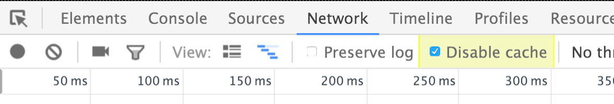

# 0. Getting Started

## Node http-server Installation

In order to setup a server that can display our Javascript apps in a web browser, we need to install a few things.

1.  [Download and Install node.js](http://nodejs.org/)
2.  In Windows, open the Node.js Command Prompt. In Mac/Linux, open the terminal.
3.  On Windows type:

        npm install -g http-server

    On OSX/Linux type:

        sudo npm install -g http-server

## Downloading the p5 Template Project

Make sure you have a good text editor ([Atom](https://atom.io/) is recommended) installed.

1. Go to  [p5 Template Project](https://github.com/Isidore-Newman-School/p5_template) to download the code for a basic project.

  

2. Unzip the folder (right click -> extract all) and move the extracted folder into a location where you'd like to save your coding projects `(e.g. Documents > Coding)`.


## Running Projects

To startup a server that can run your project, open the Node.js Command Prompt (or Terminal on Mac/Linux).

1. `cd` to the folder that has the files you want to serve- in this case, the p5-template-master folder.
2. Type the following in the command prompt / terminal:

      http-server

3. Then point your browser to `http://localhost:8080/`

If everything worked properly, you should see a blank page titled, p5 template.

## Editing the template

1. Open the `sketch.js` file (which should be inside of the p5-template-master folder) in Atom.
2. Try adding the following code to this file:

  ```javascript
  function setup() {
    createCanvas(600, 600);
    background(0, 255, 0);
  }

  function draw() {

  }
  ```

3. Save the file and reload `http://localhost:8080/` to see changes. See the note below if nothing happens.


```md
## EXERCISE
Try experimenting with the background() and createCanvas() functions.
What happens when you change the values in each?
```


## Not updating?

Things aren't updating when you change and save your code? That's probably because Chrome has cached an old sketch.js file and is ignoring changes. Take the following steps:

1. Open Chrome Dev Tools by right clicking on the page and selecting 'Inspect'.
2. Click on Network tab and make sure "disable cache" is clicked.

**NOTE**: This trick will only work when the dev panel is open, so keep that panel open while working on your project.


  


---

Instructions adapted from [Processing Wiki](https://github.com/processing/p5.js/wiki/Local-server)
