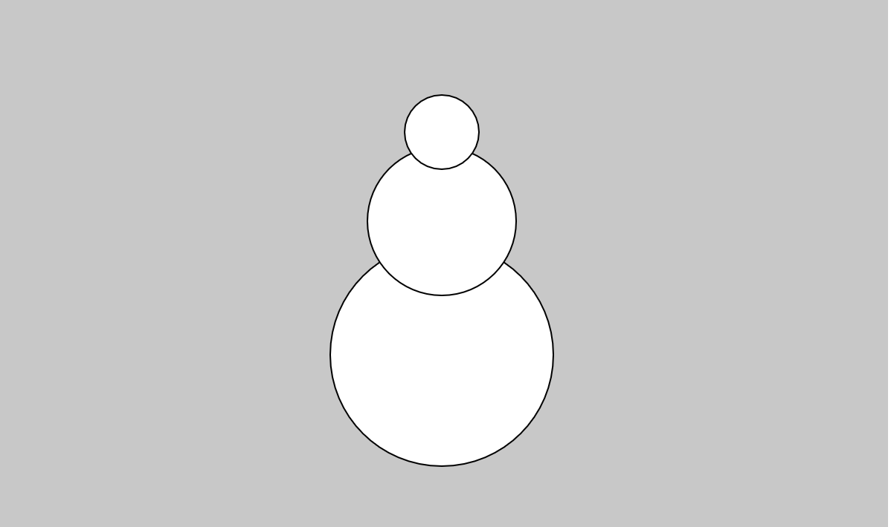
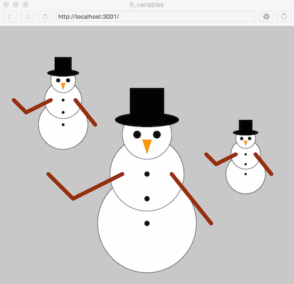

# 1. Variables and Drawing

Topics
* [I. Shapes and Drawing](#i-shapes-and-drawing)
* [II. Variables](#ii-variables)
* [III. Arithmetic with Variables](#iii-arithmetic-with-variables)

Exercises
* [Exercise 0. Snowman](#ex0)
* [Exercise 1. Variable Snowman](#ex1)
* [Extra Challenge](#extra-challenge)

---

## I. Shapes and Drawing
There are many different functions (we'll define functions later) in the p5 library for drawing shapes. Check them out in the [**p5.js reference**](http://p5js.org/reference/). Let's use the ellipse() function to draw a circle on the screen. In your sketch.js file, type:

```javascript
function setup() {
  createCanvas(600, 600);
}

function draw() {
  background(200);
  ellipse(300, 200, 50, 50);
}
```
---

<a name="ex0"></a>
<pre>
<b>Exercise 0:</b>
Show your snowman to Ms. deBB to move on to the next step.

1. Look up the <a href="https://p5js.org/reference/">p5 reference for ellipses</a>.
2. What do the four numbers inside of <b>ellipse(300, 200, 50, 50);</b> represent?
3. Create a snowman using the ellipse() function.
</pre>

  

## II. Variables

A **variable** in computer science is used to store a value. They have a descriptive name, known as the **identifier**, and they have a **data type**. There are six different types of variables in JavaScript:
  1. numbers
  2. strings        ("Hello!")
  3. booleans       (true / false
  4. objects
  5. functions      
  6. undefined values

For now, we're just going to worry about numbers. You can *declare* variables and subsequently *assign* values in the following way:

```JavaScript
var x = 100;
var y = 70.7;                
```

Why use variables? To make code more readable and portable (easy to change).


## III. Arithmetic with variables

We'll use **console.log()** to print values to the console so that we can test arithmetic on variables. Try putting the following code at the top of your sketch.js file. Open the console by right clicking on the page, clicking "inspect", and selecting the "console" tab in the developer panel.

```JavaScript
var x = 5;
var y = 10;
console.log(x + 5);     // 10
console.log(x * 5);     // 25
console.log(y / x);     // 2
```

---

<a name="ex1"></a>
<pre>
<b>Exercise 1:</b>
Show your snowman to Ms. deBB to move on to the next chapter.

Modify the <b>sketch.js</b> file to create a snowman using 3 ellipses, <em>only this time using variables.</em>
Use variables correctly so that the snowman:

1. moves as a unit when the variables "x" and "y" are changed
2. scales appropriately when the "multiplier" variable is adjusted
</pre>

```javascript
/**
* When these values are modified,
* the snowman must be preserved
*/

var x = 400;
var y = 400;
var multiplier = 1.0;


function setup() {
  createCanvas(500,500);
}

function draw() {
  background(200);

  // build the snowman!

}
```

### Extra Challenge

If you finished the basic snowman during class, experiment with other drawing functions like [line()](https://p5js.org/reference/#/p5/line) or [rect()](https://p5js.org/reference/#/p5/rect) to give the snowman arms, a hat, or nose! Check out [beginShape()](https://p5js.org/reference/#/p5/beginShape) for creating custom shapes!



---
Additional resources:  
* [**p5.js reference**](http://p5js.org/reference/)
* Check out the the section on variables and data types in [JavaScript Basics](https://github.com/robynitp/networkedmedia/wiki/Javascript-Basics)
* [Daniel Shiffman explains variables](https://www.youtube.com/watch?v=RnS0YNuLfQQ)
* [Daniel Shiffman makes his own variables](https://www.youtube.com/watch?v=Bn_B3T_Vbxs)
