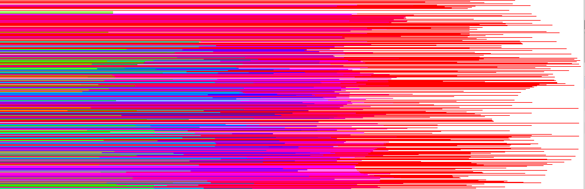

# Problem Set 0

Problem sets should be completed **individually**, but *if you have questions, don't hesitate to ask Ms. deBB* for help. Problems sets are meant to cement your understanding of Javascript concepts.

**BEFORE BEGINNING ASSIGNMENT**

1. Create a new copy of the p5 project template or copy an existing p5 project
2. Copy the code [in this template](../templates/ps0_template.md) into the sketch.js file
3. Put all problem set answers into this sketch.js script

**SUBMISSION**

* Save your project in your `Github folder > Problem Sets > PS0`
* Make sure you have pushed your Git repo to GitHub
* To review submitting assignments via GitHub, [checkout Git Instructions](https://github.com/Isidore-Newman-School/Creative-Coding-S2017/blob/master/Git%20Instructions/3_submitting.md)

---

## Variables

**(0)- 6pts** Fill out the comments below to specify what x and y equal at each line.

For the quiz, be prepared to answer this type of question with pencil and paper.

```javascript
var x = 2;  
var y = 3;
var z = 5;
z *= 3;                 // z =
x = (x * 3) - y;        // x =
y = x + x;              // y =
x--;                    // x =
y += z;                 // y =
console.log(y - x + z); // what is printed to console?
```

## Function arguments / parameters

**(1)- 10pts** Write a function, **bandNameGenerator()**, that takes 4 arguments:
1. participle (e.g. "running", "sliding", etc.)
2. plural noun
3. band founding date
4. band ending date

The function concatenates the first two strings to generate the band name, calculates the number of years the band has been around, and prints these values to the console.

E.g.

```javascript
bandNameGenerator("Barking", "waffles", 1999, 2017);
// prints: "Barkingwaffles have been around for 18 years!"
```

## Returning Functions

**(2)- 10pts** Look up the random() and floor() functions in the p5 reference. Write a function **getDiceRoll()** that returns a random number 1-6 (including 6, must be an integer).

## Challenge

**(3)- 15pts** Write a function, colorLines(), that creates [this effect](https://jennadeboisblanc.github.io/examples/ps0/index.html).



```javascript
function setup() {
  createCanvas(windowWidth, windowHeight);
  colorMode(HSB, windowHeight);
}

function draw() {
  colorLines();
}

// define colorLines() here
```
