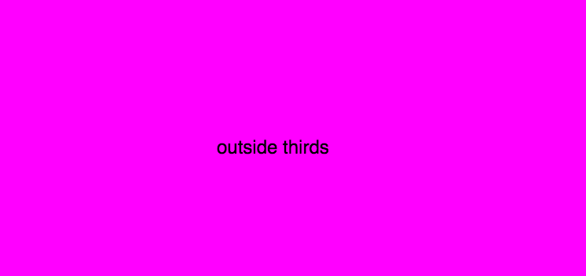

# 4. Conditionals

Topics
* [I. if / else](#i-if--else)
* [II. Booleans](#ii-booleans)
* [III. if / else if / else](#iii-if--else-if--else)
* [IV. Comparison Operators](#iv-comparison-operators)
* [V. Multiple Conditions](#v-multiple-conditions)

Exercises
* [Exercise 0](#ex0)
* [Exercise 1](#ex1)
* [Exercise 2](#ex2)
* [Exercise 3](#ex3)
* [Exercise 4](#ex4)
* [Exercise 5](#ex5)

---

## I. if / else

Conditional statements are used to give our programs logical flow. We can use conditionals to make an ellipse blue if the mouse is on the left half of the canvas, and red if it's on the right side of the canvas:

```JavaScript
function setup() {
    createCanvas(400, 400);
}

function draw() {

   if (mouseX < width/2) {
      fill(0, 0, 255);
   }
   else {
      fill (255, 0, 0);
   }

   ellipse(width/2, height/2, 100, 100);

}
```

---

<a name="ex0"></a>
<pre>
<b>Exercise 0:</b>
randTempFahrenheit is a variable that is randomly set to a temperature between -25 and 110 degrees
Fahrenheit.

Write a function, <b>hotOrCold()</b>, that sets the background to blue if the temperature is cold or red if the
temperature is hot (you can determine that temp threshold).   
</pre>

```JavaScript
var randTempFahrenheit;

function setup() {
    createCanvas(400, 400);
    randTempFahrenheit = random(-25, 110);
    console.log(randTempFahrenheit);
}

function draw() {
  hotOrCold();
}

// hotOrCold() goes here
```

---

## II. Booleans
So far we've looked at two data types- numbers and strings ("hello!"). As we move into exploring conditional logic, a new type of variable is going to become important: booleans. Booleans store if values are *true* or *false*.

```javascript
var a = true;
var b = false;
```

We can use a built-in boolean variable, mouseIsPressed, to print to the console when the mouse is pressed:

```javascript
function setup() {
    createCanvas(400, 400);
}

function draw() {

   if (mouseIsPressed) {
      console.log("mouse pressed!");
   }
   else {
      console.log("mouse NOT pressed");
   }
}
```

---

<a name="ex1"></a>
<pre>
<b>Exercise 1:</b>
On the <a href="https://p5js.org/reference/">reference</a> page under "Events", find another example of a
<b>built-in variable</b> that is a boolean.
</pre>


<a name="ex2"></a>
<pre>
<b>Exercise 2:</b>
Use mouseIsPressed and the text() function in the <a href="https://p5js.org/reference/">reference</a>.

Replicate <a href="https://jennadeboisblanc.github.io/examples/c4e0/">this example</a>.
</pre>

[](https://jennadeboisblanc.github.io/examples/c4e0/)

---

## III. if / else if / else

If we want to write a function printSign() that takes a single argument and that prints whether the value is positive, neither (zero), or negative:

```JavaScript
function setup() {
    createCanvas(400, 400);
}

function draw() {
   printSign(50);
   printSign(0);
   printSign(-10);
}

function printSign(val) {
   if (val > 0) {
      console.log(val + " is positive!");
   }
   else if (val === 0) {
      console.log(val + " is zero!");
   }
   else {
      console.log(val + " is negative!");
   }
}
```

---

<a name="ex3"></a>
<pre>
<b>Exercise 3:</b>
Begin by reading the <a href="https://p5js.org/reference/#/p5/keyPressed">keyPressed()</a> reference.
Write a simple program that changes the location of a rectangle on the screen when
the arrow keys are pressed. <a href="https://jennadeboisblanc.github.io/examples/c4e1/">Here's an example</a>.

Make sure to:
1. use the code below
2. use an if / else if / else statement
</pre>

```javascript
var x = 0;
var y = 0;

function setup() {
    createCanvas(400, 400);
}

function draw() {
    background(150);
    rect(x, y, 30, 30);
}

function keyPressed() {
    // your code here
}
```

---

## IV. Comparison Operators
In computer science, we frequently need to compare values to determine: are the values equal? Is one greater than another? Less than? A variety of operators exist to compare values.

The first operator we'll look at is the **equality** operator.
* "==" (equality operator) tests if two values are equal
* "===" (strict equality operator) tests if the two values are of the same value *and the same type*.

*NOTE*: do not get confused with the "=" (assignment operator) that assigns values to variables. This operator *is not involved in comparison*

```JavaScript
5 == 5       // true
"5" == 5     // true
"5" === 5    // false
```

---

<a name="ex4"></a>
<pre>
<b>Exercise 4:</b>
Check out some of the  <a href="http://www.w3schools.com/js/js_comparisons.asp">Javascript comparison operators</a>, and fill in the missing
boxes below by creating a chart on paper.
</pre>

`x = 8`

| Operator | Description | Comparing | Returns |
| --- | --- | --- | --- |
| == |        | x == 8  | |
|    |        | x == '8' | |
| === |       | x === 8  | |
|     |       |  x === '8' | |
| !=  |       | x != 8  | |
|     |       |  x != '8' | |
|     |       |  x != '7' | |
|  !==   |       |  x !== 8 | |
|     |       |  x !== '8' | |
|  >   |       |  x > 8 | |
|  >=   |       |  x >= 8 | |
|  <=   |       |  x <= 8 | |

---


## V. Multiple Conditions
We can use [logical operators](https://github.com/robynitp/networkedmedia/wiki/Javascript-Basics#operators) to make compound conditional statements.

For example, we can use the logical "&&" operator to test if x is between -5 **AND** 5:

```JavaScript
// from JavaScript Basics (see link above)
var x = 1;
if (x > -5 && x < 5) {
  // execute some code!
}
```

To check if x equals 5 **OR** 3:

```javascript
var x = 3;
if (x === 3 || x === 5) {
  // execute some code!
}
```

---

<a name="ex5"></a>
<pre>
<b>Exercise 5:</b>
1. Use a compound operator (either || or &&) to write a conditional statement that makes the screen
blue if the mouse is in the middle third of the canvas, and red otherwise.
2. Do the same exercise again, only use the operator that you didn't use (either || or &&).

Replicate <a href="https://jennadeboisblanc.github.io/examples/c4e4/">this example</a>.
</pre>

[](https://jennadeboisblanc.github.io/examples/c4e4/)
