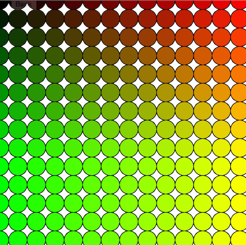

# 5. Loops

Topics
* [I. Comparison Operators](#i-comparison-operators)
* [II. Booleans](#ii-booleans)
* [III. if / else](#iii-if--else)
* [IV. if / else if / else](#iv-if--else-if--else)
* [V. Multiple Conditions](#v-multiple-conditions)

Exercises
* [Exercise 0. Comparison Operators](#ex0)
* [Exercise 1. Booleans](#ex1)
* [Exercise 2. Click Me](#ex2)
* [Exercise 3. Keyboard Controls](#ex3)
* [Exercise 4. One Third Canvas](#ex4)

---

## I. For Loops
A for loop is a control structure that allows us to iteratively repeat code. In the code snippet below we:
1. initialize a variable (x = 0)
2. check the condition each time the loop is repeated (is x < 10 ?)
3. each time the loop is over, increment the variable (x++)

```c++
for (var x = 0; x < 10; x++) {
  console.log(x);
}
```

  

---

<a name="ex0"></a>
<pre>
<b>Exercise 0:</b>
1. What is the output of the code snippet above?
2. What would we change to only print the values 63 to 100?
3. Look up the "+=" operator if you aren't familiar with it. How can we use this operator
  to <em>only print the even numbers</em> from 0 to (and including) 100?
</pre>

---

Let's say we want to draw 10 ellipses, but we want to reduce the number of lines of code. We can use a for loop in the following manner:

```javascript
function setup() {
  createCanvas(400, 400);
}

function draw() {
  fill(0, 255, 0);
  for (var x = 0; x < 10; x++) {
     ellipse(x*40, width/2, 40, 40);
  }
}
```


---

<a name="ex1"></a>
<pre>
<b>Exercise 1:</b>
How can we use a for loop to create the image below?
</pre>


---

## II. Nested Loops

It's possible to use loops inside of loops. Lets create 10 rows (by incrementing variable i) and 10 columns (by incrementing variable j) of ellipses. We'll change the RGB by i and j.

```c++
function setup() {
  createCanvas(400, 400);
}

function draw() {
  for (var i = 0; i < 10; i++) {
     for (var j = 0; j < 10; j++) {
        fill(0, i*20, j*20);
        ellipse(i*40, j*40, 40, 40);
     }
  }
}
```



---

<a name="ex2"></a>
<pre>
<b>Exercise 2:</b>

</pre>


---

## III. While Loops

While loops are also used to repeatedly execute code. Unlike for loops, however, while loops continue to repeat as long as the input condition is true. E.g.:

```javascript
while( /* boolean test */ ) {
    // code to repeat goes here
}
```
