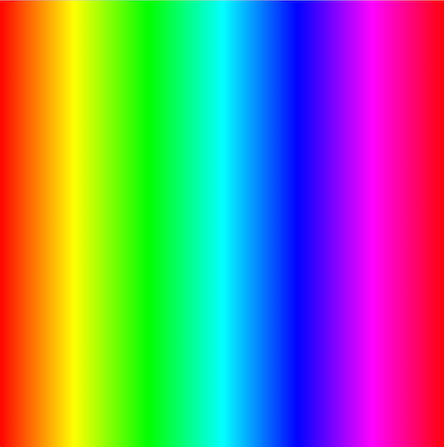

# 5. Loops

Topics
* [I. For Loops](#i-for-loops)
* [II. Nested Loops](#ii-nested-loops)
* [III. While Loops](#iii-while-loops)

Exercises
* [Exercise 0. For Loop](#ex0)
* [Exercise 1. Diagonal Loop](#ex1)
* [Exercise 2. Gradient](#ex2)
* [Exercise 3. Nested Loop](#ex3)
* [Exercise 4. While Loop](#ex4)

---

## I. For Loops
A for loop is a control structure that allows us to iteratively repeat code. In the code snippet below we:
1. initialize a variable (x = 0)
2. check the condition each time the loop is repeated (is x < 10 ?)
3. each time the loop is over, increment the variable (x++)

```c++
for (var x = 0; x < 10; x++) {
  console.log(x);
}
```

  

---

<a name="ex0"></a>
<pre>
<b>Exercise 0:</b>
1. What is the output of the code snippet above?
2. What would we change to only print the values 63 to 100?
3. Look up the "+=" operator if you aren't familiar with it. How can we use this operator
  to <em>only print the even numbers</em> from 0 to (and including) 100?
</pre>

---

#### Drawing Ellipses
Let's say we want to draw 10 ellipses, but we want to reduce the number of lines of code. We can use a for loop in the following manner:

```javascript
function setup() {
  createCanvas(400, 400);
}

function draw() {
  fill(0, 255, 0);
  for (var x = 0; x < 10; x++) {
     ellipse(x*40, width/2, 40, 40);
  }
}
```

  

---

<a name="ex1"></a>
<pre>
<b>Exercise 1:</b>
How can we use a for loop to create the image below?

Hint: fill(0) is black and fill(255) is white...
</pre>

  

---

#### Gradient with colorMode()

Let's do something a little more fancy. Let's make a rainbow gradient! We'll use [**colorMode(HSB, 1)**](http://p5js.org/reference/#/p5/colorMode) to switch from a RGB color scale to a HSB (hue, saturation, brightness) scale.

The advantage of this scale is that we can adjust the value of the hue while keeping saturation and brightness constant in order to cycle through the colors of the rainbow.

*NOTE*: The second argument of colorMode() (100 in the example below), sets the max value of the range of number the function accepts. So in the example below, instead of a range of 0-255, the color scale will be out of 0-100.

```javascript
colorMode(HSB, 100);
// fill(0, 100, 100);   -> red at full brightness and saturation
// fill(10, 100, 100);  -> orange at full brightness and saturation
// fill(20, 100, 100);  -> yellow at full brightness and saturation
// ...
// fill(100, 100, 100);  -> pink at full brightness and saturation
```

```javascript
function setup() {
  createCanvas(400, 400);
  colorMode(HSB, 100);  
}

function draw() {
  for (var i = 0; i < width; i++) {
     stroke(i/4, 100, 100);
     line(i, 0, i, height)
  }
}
```



---

<a name="ex2"></a>
<pre>
<b>Exercise 2:</b>
Modify the code above so that the background is a gradient from red to green- not the entire rainbow.
</pre>

---

## II. Nested Loops

It's possible to use loops inside of loops. Let's create 10 rows (by incrementing variable i) and 10 columns (by incrementing variable j) of ellipses. We'll change the RGB by i and j.

```c++
function setup() {
  createCanvas(400, 400);
}

function draw() {
  for (var i = 0; i < 10; i++) {
     for (var j = 0; j < 10; j++) {
        fill(0, i*20, j*20);
        ellipse(i*40, j*40, 40, 40);
     }
  }
}
```


---

<a name="ex3"></a>
<pre>
<b>Exercise 3:</b>
Use a nested for loop to create the image below.
</pre>

  

---

## III. While Loops

While loops are also used to repeatedly execute code. Unlike for loops, however, while loops continue to repeat as long as the input condition is true. E.g.:

```javascript
var i = 0;
while( i < 10 ) {
    i += 2;
}
```
**Beware**: It's easy to accidentally cause an *"infinite loop"* by failing to create conditions that exit the while loop.

---

<a name="ex4"></a>
<pre>
<b>Exercise 4:</b>
With *pencil and paper*, prove why console.log() outputs "4 16"

Hint: Use a table to keep track of the value of x and y as you step through the program.
</pre>

```javascript
var x = 10;
var y = 1;

while (x > 5) {
  while (y < x) {
    y *= 2;
  }
  x -= 2;
}

console.log(x + " " + y);
```
