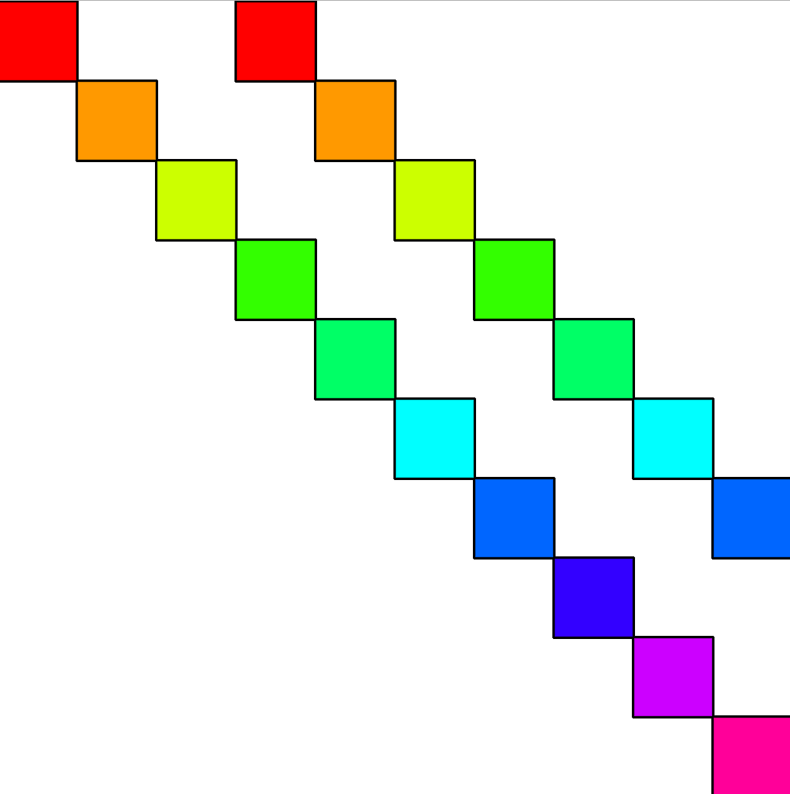

# Problem Set 1

Problem sets should be completed **individually**, but *if you have questions, don't hesitate to ask Ms. deBB* for help. Problems sets are meant to cement your understanding of Javascript concepts.

**BEFORE BEGINNING ASSIGNMENT**

1. Create a new copy of the p5 project template or copy an existing p5 project
2. Copy the code [in this template](../templates/ps1_template.md) into the sketch.js file
3. Put all problem set answers into this sketch.js script

**SUBMISSION**

* Save your project in your `Github folder > Problem Sets > PS0`
* Make sure you have pushed your Git repo to GitHub
* To review submitting assignments via GitHub, [checkout Git Instructions](https://github.com/Isidore-Newman-School/Creative-Coding-S2017/blob/master/Git%20Instructions/3_submitting.md)

---

## Conditionals

**(0)** Write a function, **didGreeniesWin()**, that takes three arguments- Newman's opponent, Newman's score, and the opponent's score. If Newman won, print to the console, "Greenies are victorious!". If the Greenies tied, print "Greenies tied with [insert opponent]." Otherwise print, "Sad day indeed. [Insert opponent] won."

```javascript
function setup() {
  createCanvas(500, 500);
  didGreeniesWin("Pope John Paul II", 21, 14);
  didGreeniesWin("Jesuit", 3, 40);
}

function draw() {}

// didGreeniesWin() goes here
```


**(1)** Fill in the missing code in bounceEllipse() to make the ball bounce like in [this example](https://jennadeboisblanc.github.io/examples/ps1/).

```JavaScript
var x = 0;
var speed = 10;
var direction = 1;

function setup() {
  createCanvas(500, 500);
}

function draw() {
  background(100, 0, 100);
  bounceEllipse();
}

function bounceEllipse() {
  // some code here

  x += speed * direction;
  ellipse(x, width/2, 50, 50);
}

```

## Loops

**(2)** Fill out the function, **doubleRainbow()**. Use a single for loop to create the following image:

```javascript
function setup() {
  createCanvas(500, 500);
  colorMode(HSB, 10);
}

function draw() {
  doubleRainbow();
}

function doubleRainbow() {
  // your code here
}
```




**(4)** In computer science the "%" (a.k.a. the modulo operator) is surprisingly useful. It is used to calculate the remainder after dividing the first number from the second. E.g.:

    5%2 = 1;
    4%2 = 0;
    3%2 = 1;
    2%2 = 0;
    1%2 = 1;
    0%2 = 0;

We can use the modulo operator to determine if a number is even (divisible by 2). For example:

```javascript
var num = 5;
if (num % 2 == 0) {
  // no remainder, must be divisible by 2
  // i.e. even
}
else {
  // not divisible by 2
}
```

Using the example above, write a function, **fooBarFizz()**, that uses a for loop to iterate from 1 to 20. For each iteration, it prints the number and:
1. if the number is divisible by 2, print "foo"
2. if the number is divisible by 3, print "bar"
3. if the number is divisible by both 2 and 3, print "fuzz"

E.g.

    1
    2 foo
    3 bar
    4 foo
    5
    6 fuzz
    7
    ... etc.


```javascript
function setup() {
  createCanvas(500, 500);
}

function draw() {
  fooBarFizz();
}

function fooBarFizz() {
  // your code here
}
```
