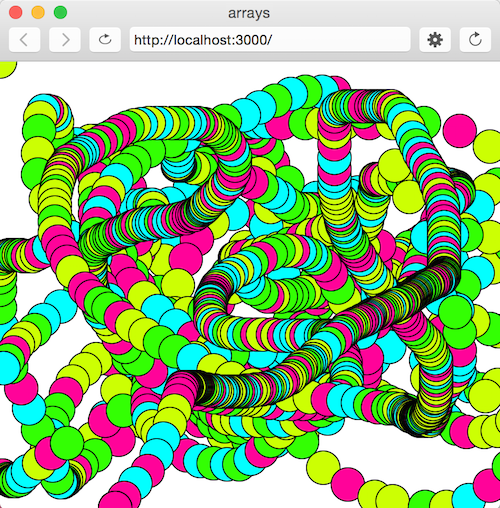
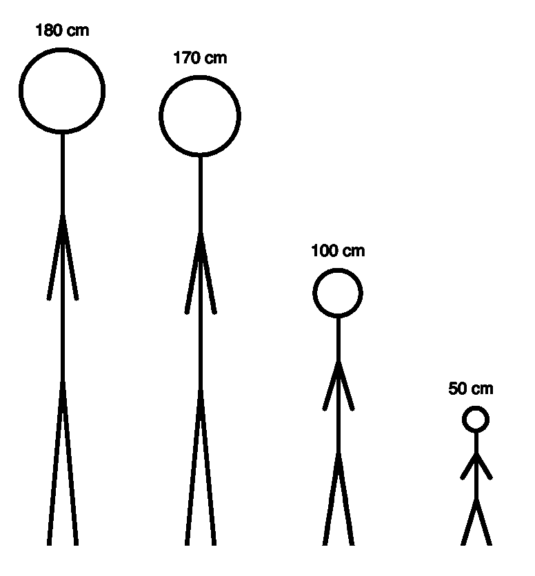

# 6. Arrays

Topics
* [I. Accessing Arrays](#i-accessing-arrays)
* [II. Loops and Arrays](#ii-loops-and-arrays)
* [III. Aggregation](#iii-aggregation)
* [IV. Other array methods](#iv-other-array-methods)
* [V. Multi-dimensional Arrays](#v-multi-dimensional-arrays)

Exercises
* [Exercise 0](#ex0)
* [Exercise 1](#ex1)
* [Exercise 2](#ex2)
* [Exercise 3](#ex3)
* [Exercise 4](#ex4)
* [Exercise 5](#ex5)

---

## I. Accessing Arrays

Arrays are used to store multiple values in a single variable. Arrays can store any type of data:

  ```javascript
  var emptyArray = [];
  var names = ["Jenna", "Jessica", "James"];
  var years = [2019, 2017, 2015, 2000];
  var random = [ "woot!", -19.4, false];
  ```

We can use an index (beginning with 0) to access the values in an array:

  ```javascript
  var  arr = [10, "Jenna", true];

  console.log(arr[0]);        // 10
  console.log(arr[1]);        // "Jenna"
  console.log(arr[2]);        // true
  ```

Or we can use an index to set values of an array:

  ```javascript
  var  arr = [10, "Jenna", true];

  arr[0] = -17;
  console.log(arr[0]);        // -17
  console.log(arr[1]);        // "Jenna"
  ```

---

<a name="ex0"></a>
<pre>
<b>Exercise 0:</b>
Using the array below, print to the console, "Jenna deBB lives in 70115 (New Orleans, LA)"
</pre>

```javascript
var  address = ["Jenna deBB", "123 Drive", "New Orleans", "LA", 70115];
```

<a name="ex1"></a>
<pre>
<b>Exercise 1:</b>
1. Create an array of 4 numbers (0 - 100) representing different color hues.
2. Set the variable hue (below) equal to a randomly selected hue <em>from the array</em>.

Hint: Use <a href="https://p5js.org/reference/#/p5/random"><b>random()</b></a> function and <a href="https://p5js.org/reference/#/p5/floor"><b>floor()</b></a> to randomly
select one of the items in the array.
</pre>


```javascript

// your array here

function setup() {
  createCanvas(400, 400);
  colorMode(HSB, 100);
}

function draw() {

  var randomNum = floor(random( /* your code here */ ));
  console.log(randomNum);

  var hue = // your code here;

  fill(hue, 100, 100);
  ellipse(mouseX, mouseY, 50, 50);
}
```



---


## II. Loops and Arrays

We can use a for loop and **.length** to iterate through the elements of an array:

```javascript
var  arr = [1, 3, 4];

for (var i = 0; i < arr.length; i++) {  
  console.log(arr[i] + "!")      
}

// 1!
// 3!
// 4!

console.log(arr);   // [1, 3, 4]
```

---

<a name="ex2"></a>
<pre>
<b>Exercise 2:</b>
Create an array representing the heights (in centimeters) of 5 members of a family.

Use a for loop to iterate through the array and draw a stick figure (see function below)
for each member of the family.
</pre>

```javascript

// your array here

function setup() {
  createCanvas(400, 400);
}

function draw() {

  // your code here

}

function stickFigure(x, personHeight) {
  personHeight *= 2;  // making stick people 2x the height in pixels
  fill(150);
  strokeWeight(3);

  // head
  noFill();
  stroke(0);
  ellipse(x, height-personHeight+personHeight/12, personHeight/6);

  // body
  fill(0);
  line(x, height-personHeight+personHeight/6, x, height-personHeight/3);

  // legs
  line(x-10, height, x, height-personHeight/3);
  line(x+10, height, x, height-personHeight/3);

  // arms
  line(x-10, height-personHeight/2, x, height-personHeight/3*2);
  line(x+10, height-personHeight/2, x, height-personHeight/3*2);

  // height text
  textWidth(14);
  strokeWeight(0);
  text(personHeight/2 + " cm", x-textWidth(personHeight + " cm")/2, height-personHeight -10);
}
```



---

## III. Aggregation

We can write a function **sumArray()** that takes an array of arbitrary length as an argument and prints to the console the sum of all of the elements in the array. E.g.:

```javascript
function setup() {}

function draw() {
    sumArray([2, 4, 1, 2]);     // should print 9
    sumArray([2, 1, -5]);       // should print -2
}

function sumArray(arr) {
    var sum = 0;
    for (var i = 0; i < arr.length; i++) {
        sum += arr[i];
    }
    console.log(sum);
}
```

---

<a name="ex3"></a>
<pre>
<b>Exercise 3:</b>
Write a function, <b>sumEven()</b>, that only adds up the even numbers in an array. It prints this
sum to the console.

Hint: use the function isEven() in your conditional statement.
</pre>

```javascript
function setup() {}

function draw() {
  sumEven([2, 4, 1, 2]);     // should print 8
  sumEven([2, 1, -5]);       // should print 2
}

function sumEven(arr) {

  // your code here

}

function isEven(num) {
  if (num%2 == 0) return true;
  return false;
}
```

---


## IV. Other array methods

#### push()

This function adds (pushes) a new element to the end of the array, increasing the length of the array by 1.

```javascript
var arr = [30, 10, 0];
arr.push(200);
console.log(arr.length);      // 4
console.log(arr);             // [30, 10, 0, 200]
```

#### indexOf()

This function returns the index of a given element, or returns -1 if that element isn't found in the array.

```javascript
var arr = [2, 5, 9];
var index = arr.indexOf(2);   // 0
index = arr.indexOf(7);       // -1
index = arr.indexOf(9);       // 2
```

---

<a name="ex4"></a>
<pre>
<b>Exercise 4:</b>
Write a function, <b>lookForGold()</b>, that uses indexOf() to determine if "gold" occurs in an
array. It prints to the console, "GOLD" if so; otherwise, it prints, "Keep digging!"
</pre>

```javascript
var goldArray = ["dirt", "dirt", "rocks", "dirt", "pebbles", "gold", "dirt", "clay"];
var rockArray = ["rocks", "dirt", "pebbles", "clay"];

void setup() {
  lookForGold(goldArray);
  lookForGold(rockArray);
}

void draw() { }

// lookForGold() goes here

```

---


## IV. Multi-dimensional Arrays
It's possible in JavaScript to have arrays within arrays. Here is an example of a multi-dimensional array:

```javascript
var arr = [
    ["Jenna", "blueberry", "apple"],
    [1, 2, 3],
    [true, "Katy Perry", -35.0]
];
```

How do we access the elements in this two dimensional array? The same way as before- using square brackets.

```javascript
console.log(arr[0][1]);     // "blueberry"
```

---

<a name="ex5"></a>
<pre>
<b>Exercise 5:</b>
How do we access "Katy Perry" in the array above?
</pre>

---


[For more information about multi-dimensional arrays, check out this article.](http://www.dyn-web.com/javascript/arrays/multidimensional.php)
