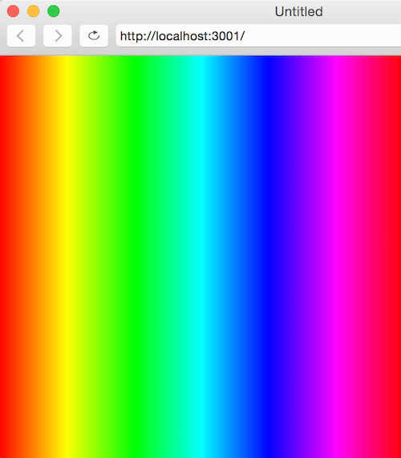
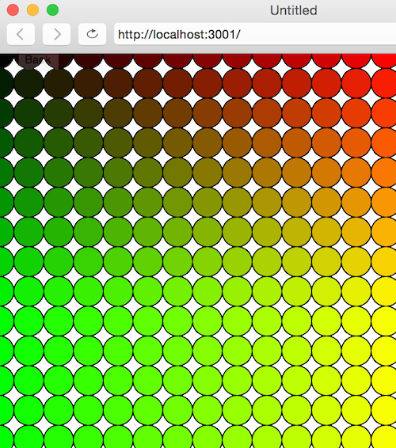
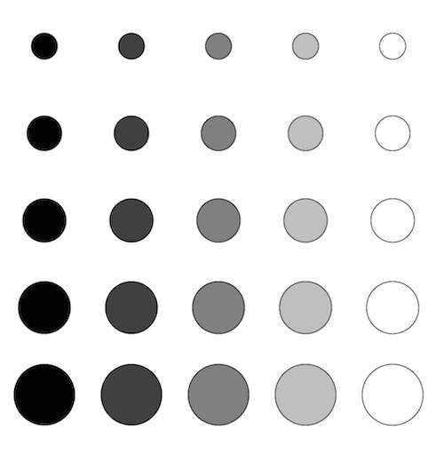

# C4. Loops

## For

A for loop is a control structure that allows us to iteratively repeat code. For example, the following code snippet repeats 10 times:

```c++
for (var x = 0; x < 10; x++) {
  console.log(x);
}
```

This for loop prints:

    0  
    1  
    2  
    ... (you get the point)  
    9  

At the beginning of the loop, x is 0 and the loop repeats until x is no longer less than 10. The "x++" specifies that the value of x should increment by 1 after each execution of the loop.

If we wanted to draw ellipses across the screen, we can increment a variable x by 40 ("x+=40") until x is no longer less than the canvas width.

```c++
function setup() {
  createCanvas(400, 400);
}

function draw() {
  fill(0, 255, 0);
  for (var x = 0; x < width; x+=40) {
     ellipse(x, width/2, 40, 40);
  }
}
```


Let's do something a little more fancy. Let's make a rainbow gradient! We'll use [**colorMode(HSB, 1)**](http://p5js.org/reference/#/p5/colorMode) to switch from a RGB color scale to a HSB (hue, saturation, brightness) scale. That way we can adjust the value of the hue while keeping saturation and brightness constant in order to cycle through the colors of the rainbow. 

We'll draw lines across the entire width and change the stroke's hue each time we increment in the for loop. Since the width of the canvas is 400 and the max val of hue is 100, we divide the interation variable by 4 in the stroke:

```c++
function setup() {
  createCanvas(400, 400);
  colorMode(HSB, 100);  // Hue, saturation, brightness with a max value of 100
}

function draw() {
  for (var i = 0; i < width; i++) {
    /* hue is divided by 4 since the max value of i = width = 400 which is 4x greater than the max hue value (100) */
     stroke(i/4, 100, 100);
     line(i, 0, i, height)
  }
}
``` 



## Nested for loops

It's possible to use for loops inside of for loops. Lets create 10 rows (by incrementing variable i) and 10 columns (by incrementing variable j) of ellipses. We'll change the RGB by i and j.

```c++
function setup() {
  createCanvas(400, 400);
}

function draw() {
  for (var i = 0; i < 10; i++) {
     for (var j = 0; j < 10; j++) {
        fill(0, i*20, j*20);
        ellipse(i*40, j*40, 40, 40);
     }
  }
}
```



### Exercise
Can you use a nested for loop to create the following image?



## While
While loops are also used to repeatedly execute code. Unlike for loops, however, while loops continue to repeat as long as the input condition is true. E.g.:

```c++
var x = true;

while(x) {
    // code to repeat goes here
}
```
