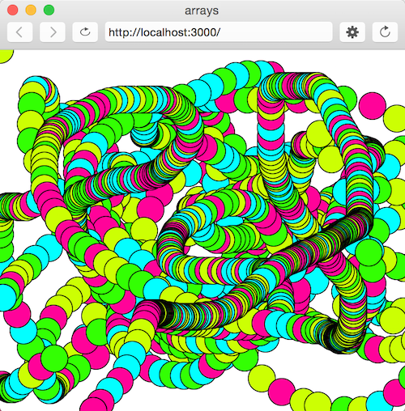
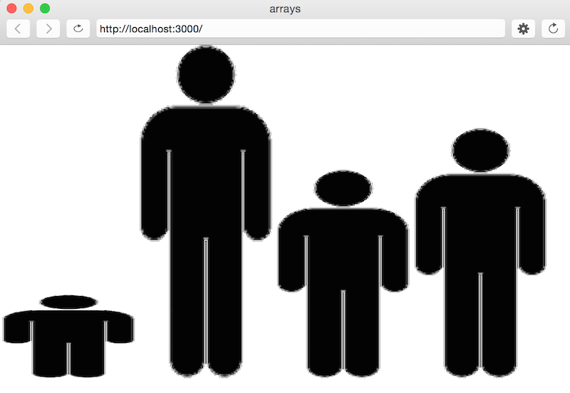

# c5. Arrays

Arrays are used to store multiple values in a single variable. Arrays can store any type of data:

```javascript
var emptyArray = []; 
var names = ["Jenna", "Jessica", "James"];
var years = [2019, 2017, 2015, 2000];
var random = [ "woot!", -19.4, false]; 
```

## Accessing Arrays
We can use an index (beginning with 0) to access the values in an array:

```javascript
var  arr = [10, "Jenna", true];

console.log(arr[0]);        // 10
console.log(arr[1]);        // "Jenna"
console.log(arr[2]);        // true
```

Or we can use an index to set values of an array:

```javascript
var  arr = [10, "Jenna", true];

arr[0] = -17;
console.log(arr[0]);        // -17
console.log(arr[1]);        // "Jenna"
```

We can use a for loop and **.length** to iterate through the elements of an array:

```javascript
var  arr = [1, 3, 4];

for (var i=0; i<arr.length; i++) {
  arr[i]*=2;       
}
console.log(arr.length);    // 3
console.log(arr);           // [2, 6, 8]
```

## push()

This function adds (pushes) a new element to the end of the array, increasing the length of the array by 1.

```javascript
var arr = [30, 10, 0];
arr.push(true);
console.log(arr.length); // 4
console.log(arr); // [30, 10, 0, true]
```

## indexOf()

This function returns the index of a given element, or returns -1 if that element isn't found in the array.

```javascript
var array = [2, 5, 9];
var index = array.indexOf(2); // 0
index = array.indexOf(7); // -1
index = array.indexOf(9); // 2
```


## Multi-dimensional Arrays
It's possible in JavaScript to have arrays within arrays. Here is an example of a multi-dimensional array:

```javascript
var arr = [
    ["Jenna", "blueberry", "apple"],
    [1, 2, 3],
    [true, "Katy Perry", -35.0]
];
```

How do we access the elements in this two dimensional array? The same way as before- using square brackets.

```javascript
console.log(arr[0][1]); // "blueberry"
```

How do we access "Katy Perry"?

[For more information about multi-dimensional arrays, check out this article.](http://www.dyn-web.com/javascript/arrays/multidimensional.php)

## Excerises
**1. Sum an Array** - Write a function **sumArray()** that takes an array of arbitrary length as an argument and *returns* the sum of all of the elements in the array.

```javascript
function draw() {
    var total = sumArray([2, 4, 1, 2]); 
    console.log(total);                     // should print 9
}
function sumArray(arr) {
    var sum = 0;
    for (var i = 0; i < arr.length; i++) {
        sum += arr[i];
    }
    return sum;
}
```

**2. Array of Hues** - Create an array of your 4 favorite hues. Use the [**random()**](https://p5js.org/reference/#/p5/random) function and [**Math.floor()**](http://www.w3schools.com/jsref/jsref_floor.asp) to randomly select one of the hues each time the draw function is called, and to draw an ellipse at mouseX and mouseY in that particular hue.



**3. Lottery** - Create a lottery ticket array of 5 of your favorite numbers between 0 and 50. Write a function, **checkTicket()** that creates an array of random numbers between 0 and 50 (use **random()** and **Math.floor**). Using a for loop, count how many of the numbers in your array are in the random ticket array and print the result to the console!

**4. For loops + Arrays** - Create an array representing the heights of 4 members of a family. Look up how to use [**loadImage()** and **image()**](https://p5js.org/examples/examples/Image_Load_and_Display_Image.php) to load a stick figure picture. Create 4 copies of that picture and scale the height of each based on the heights stored in the array.


