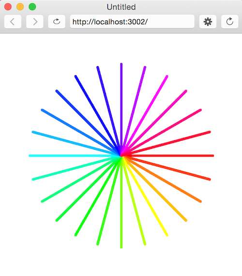

# Review 0.
### Variables, Functions, Conditionals, Loops

**(1)** In computer science the "%" (a.k.a. the modulo operator) is surprisingly useful. It is used to calculate the remainder after dividing two numbers. E.g.:

    5%2 = 1;
    4%2 = 0;
    3%2 = 1;
    2%2 = 0;
    1%2 = 1;
    0%2 = 0;

Use the modulo operator to write a function **isEven()** that *returns* true if the number is even and false if odd.

**(2)** Write a program that uses **console.log()** to print all the numbers from 1 to 100, with two exceptions. For numbers divisible by 3, print "Fizz" instead of the number, and for numbers divisible by 5 (and not 3), print "Buzz" instead.

When you have that working, modify your program to print "FizzBuzz", for numbers that are divisible by both 3 and 5 (and still print "Fizz" or "Buzz" for numbers divisible by only one of those).

*Adapted from* [Eloquent JavaScript](http://eloquentjavascript.net/02_program_structure.html).

**(3)** Look up the [**random()**](http://p5js.org/reference/#/p5/random) function and the [**Math.floor()**](http://www.w3schools.com/jsref/jsref_floor.asp). Write a function **getDiceRoll()** that *returns* a random number 1-6 (must be an integer).

**(4)** Look up the function [**keyPressed()**](https://p5js.org/reference/#/p5/keyPressed). If the up arrow key is pressed, use the **getDiceRoll()** function to draw the number of ellipses returned by **getDiceRoll()**. For example, if **getDice()** returns 3, draw 3 ellipses on the screen. Every time the up arrow is pressed, roll the die again.

**(5)** How can we use trig and a for loop to draw the following image?

**(6)** EXTRA HARD CHALLENGE: How can we use a nested for loop and some global variables to animate this image? Over time, the number of lines emanating from the center point should increase and decrease.