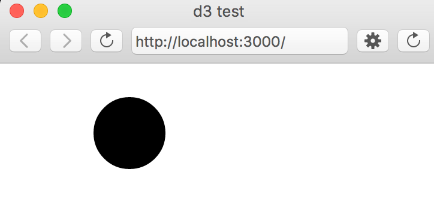
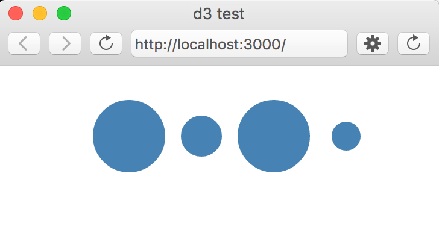

# c1. D3 Introduction
---

**NOTE**: There are awesome [D3 tutorials on the web, like this one](http://alignedleft.com/tutorials/d3) from Scott Murray. Google = friend.

---

D3 is a powerful and fast data visualization library for JavaScript. Before we begin, make sure you're familiar with the basics of:

* HTML - Hypertext Markup Language
* DOM - Document Object Model
* CSS - Cascading Stylesheet
* SVG - Scalable Vector Graphic

Make sure localhost is running (check by navigating to http://localhost/).

## Setup
Clone or download and unzip the [D3 template](https://github.com/Isidore-Newman-School/d3-template) inside of the directory where your localhost server looks for files. You should now have the following file structure:

* d3-template
  * libraries
    * d3.v3.js
  * index.html
  * d3script.js

You can either type JavaScript/D3 code inside of the ```<script>``` tags of the HTML file, or you can type it in the d3script.js external file.

## Method Chaining
D3 uses [**method chaining syntax**](http://alignedleft.com/tutorials/d3/chaining-methods) to apply multiple methods to a single object- a fast and easy approach to avoid code redundancy. For example, to add a new paragraph to the body of the HTML document above:

```javascript
d3.select("body").append("p").text("New paragraph!");
```
which can also be written as:

```javascript
d3.select("body")
    .append("p")
    .text("New paragraph!");
```
which is much more efficient than the usual way without chaining:

```javascript
var body = d3.select("body");
body.append("p");
body.text("New paragraph!");
```

## SVG
Let's create an svg and append a circle to it. In our index.html file inside the script tags, add the following:

```javascript
var svg = d3.select("body").append("svg");

svg.append("circle")
  .attr("cx", 100)
  .attr("cy", 50)
  .attr("r", 30);
```


## Data Binding
Let's say we want to make a bunch of circles whose radius is based on population data from a JSON file. For now we're just going to use an array of arbitrary numbers, but in the future we'll look at binding to external data files.

The process to bind data to any DOM elements:

1. **select** which DOM elements you want to bind to (these elements may or may not already exist)
2. **.data**(<array>)
3. **.enter**()
4. **.append**(<what type of element you are appending>)
5. any other relevant chained methods

```javascript
// creates svg circles- the same number of circles as elements in the data array
svg.selectAll("circle")
  .data([32, 17, 30, 12])
  .enter()
  .append("circle")
  .attr("cx", function(d, i) { return i*60 + 100; }) // i is incremented with each item in data array
  .attr("cy", 50)
  .attr("r", function(d, i) { return d; } );  // d


// set all of the circles to blue fill        
svg.selectAll("circle").style("fill", "steelblue");

```


## Exercise

Can you create a scatter plot from a 2D array of data?
