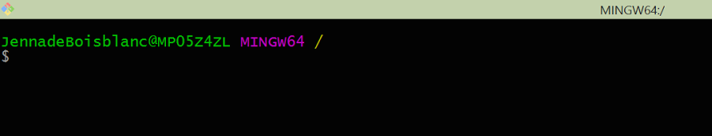
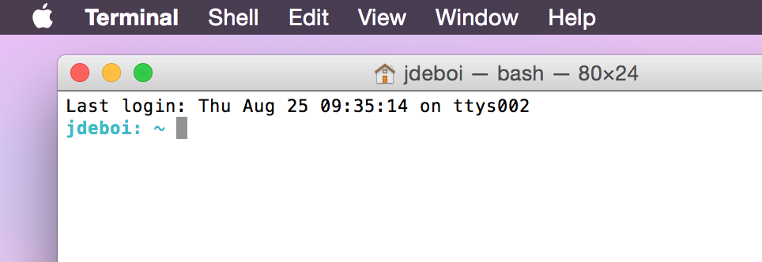
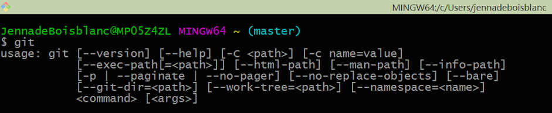
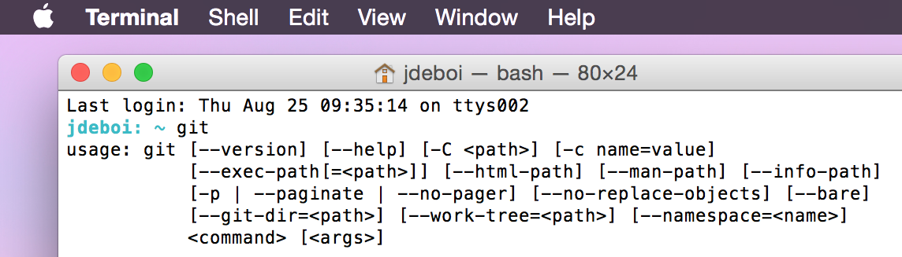

# Git 0. Installing
Make sure you've installed [Git for Windows](https://git-scm.com/download/win), and open this program. 

 * If you're running Linux or Mac OS, open a terminal window (Google if you're unsure how to do that) and follow the instructions for [installing Git on Mac OS/ Linux](https://git-scm.com/book/en/v2/Getting-Started-Installing-Git). 

You should have a screen that looks something like the following:






Type git to make sure everything is setup correctly.
```bash
git
```




## Git Config
We need to setup a user that will be attached to "commits". Type the following (making sure to substitute your name and email) in to the command line:
```bash
git config --global user.name "jennadeboisblanc"
git config --global user.email jennadeboisblanc@newmanschool.org
```

For additional information, such as setting up a default editor in Git, check out [Git-Getting Started](https://git-scm.com/book/en/v2/Getting-Started-First-Time-Git-Setup).


---
* [-> Git 1. Command Line Basics](1_commandLine.md)
