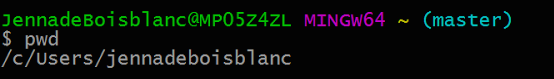
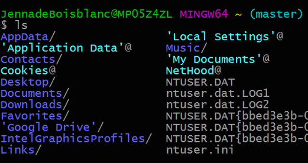
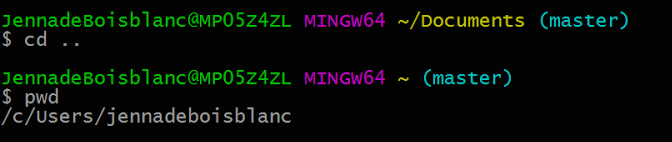
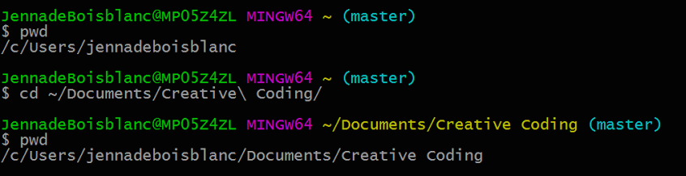

# Git 1. Command Line Basics
We're going to need some basic commands in order to navigate [BASH](https://en.wikipedia.org/wiki/Bash_(Unix_shell)) and use Git.

* [pwd](#pwd) - print working directory
* [ls](#ls) - list contents of current directory
* [cd](#cd) - change directory

## pwd
The following command prints the working directory (what folder you're currently in):
```bash
pwd
```



## ls
To list all of the contents of that directory:
```bash
ls
```



## cd
To open a directory, type "cd" and the name of the folder or path to the directory you'd like to open:
```bash
cd Documents
```


To go back a directory, type:
```bash
cd ..
```

Make sure we're back where we started:
```bash
pwd
```



Go to a specific path:

* **NOTE**: "~/" refers to the home directory, in my case, "/c/Users/jennadeboisblanc", which we can see when we subsequently type pwd:
* **NOTE**: Trying pressing the tab key while type a directory name for auto-completion
```bash
cd ~/Documents/Creative\ Coding
pwd
```




---
[<- Git 0. Installing](0_installing.md) | [Git 2. Cloning Your Repo ->](2_cloning.md)
