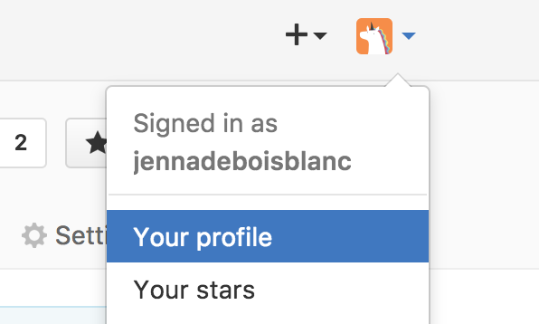
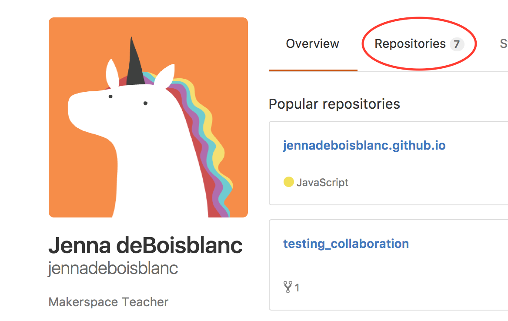
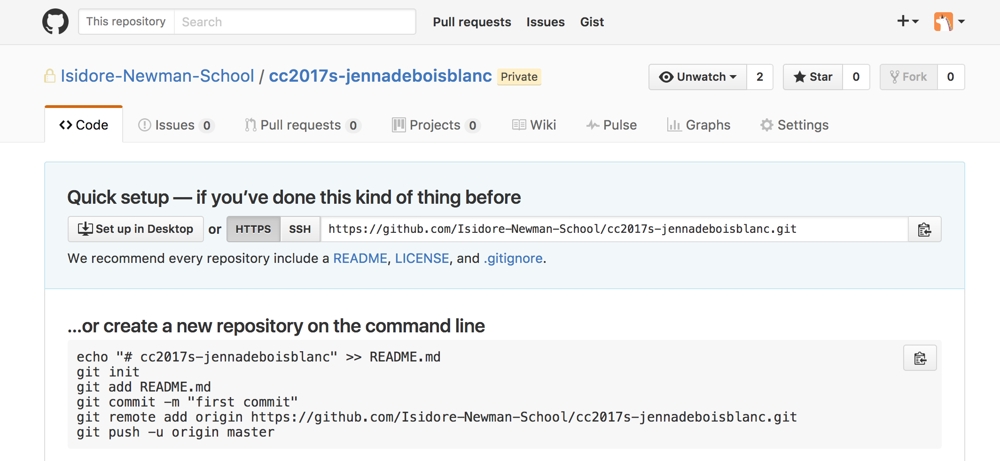

# Git 2. Cloning Your Repo

This section covers submitting to GitHub for the first time. Each student was assigned a private repository (repo). When students save work in this repo locally (on their computers) and subsequently "push" it to GitHub, Ms. deBB will be able to see the submitted assignment.

You should have automatically created your repo by clicking on a link on the class iNewman page. Your repo should be something like, `ccs2017-jennadeboisblanc`. To find it:

  1. click on your profile icon and select "profile"

    

  2. click on *repositories*

    

  3. Click on the `ccs2017-[your user name]`. It should look something like this:

    


## Navigate to local directory

In Git for Windows (or in a terminal window if you're on Mac OS/ Linux) navigate to the folder *on you computer* where you'd like to save the local copy of your repository. You may want to create a folder first, and then change into that directory.

If you'd like to save your repo in the "Coding" folder, cd to this directory:

```bash
cd /Users/[jennadeboisblanc]/Documents/Coding
```


## Clone GitHub Repo

* Go back to your repo on GitHub.

* To make a local copy of this repo, follow the instructions to **create a new repository on the command line** by *copying that code in the red box below* and pasting it into your terminal.

  


We will discuss these commands in the next section. For now, just know that you created a README.md file with the heading "# your-repo", initialized a local git repo, and subsequently pushed this local repo to GitHub. In my case, I pasted the following commands:

If that worked, you should now have a README.md file on your computer *and* online when you refresh the page of the `ccs2017-[your user name]` repo.

  


---
[<- Git 1. Command Line Basics](1_commandLine.md) | [Git 3. Submitting Assignments ->](3_submitting.md)
