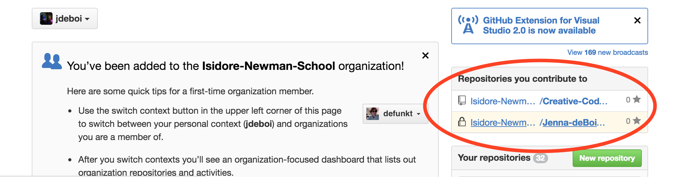
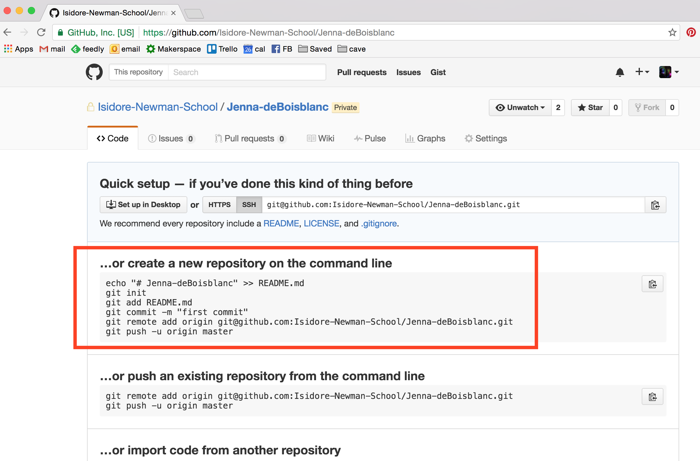
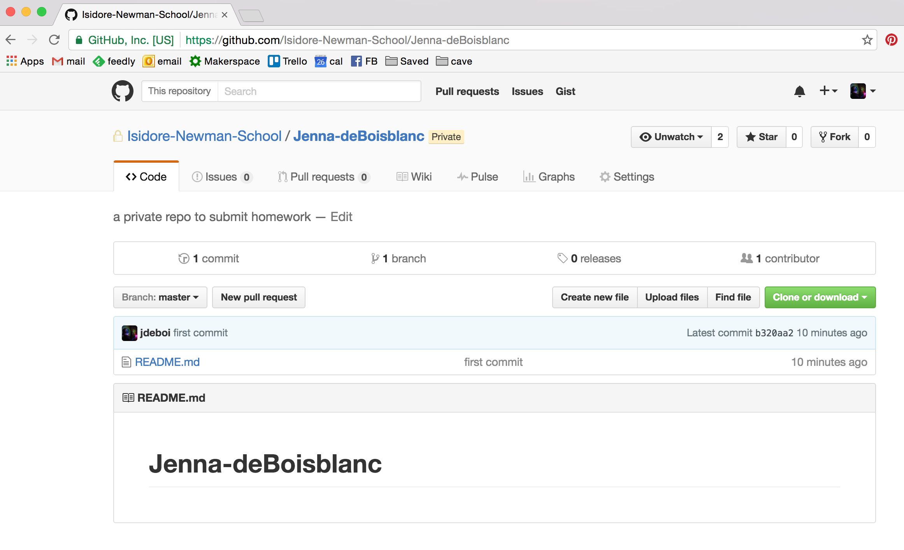

# Git 2. Cloning Your Repo

This section covers submitting to GitHub for the first time. Each student was assigned a private repository (repo). When students save work in this repo locally (on their computers) and subsequently "push" it to GitHub, Ms. deBB will be able to see the submitted assignment.

You should have received an email to be a collaborator on a private repo with your name. Ask Ms. deBB if you did not receive this email or if you do not see this repository in your online profile:




## Navigate to local directory

In Git for Windows (or in a terminal window if you're on Mac OS/ Linux) navigate to the folder *on you computer* where you'd like to save the local copy of your repository. You may want to create a folder first, and then change into that directory.

If you'd like to save your repo in the "Coding" folder, cd to this directory:

```bash
cd /Users/[jennadeboisblanc]/Documents/Coding
```


## Clone GitHub Repo

* Find the empty repo on GitHub. The page should look something like the following:



* To make a local copy of this repo, follow the instructions to **create a new repository on the command line** by copying that code and pasting it into your terminal. We will discuss these commands in the next section. For now, just know that you created a README.md file with the heading "# your-repo", initialized a local git repo, and subsequently pushed this local repo to GitHub. In my case, I pasted the following commands:

```bash
echo "# Jenna-deBoisblanc" >> README.md
git init
git add README.md
git commit -m "first commit"
git remote add origin git@github.com:Isidore-Newman-School/Jenna-deBoisblanc.
git push -u origin master
```


* If that worked, you should now have a README.md file on your computer in the directory where you typed these commands (in my case, Documents > Coding). If you refresh the online page, you should now see a blank README.md:




---
[<- Git 1. Command Line Basics](1_commandLine.md) | [Git 3. Submitting Assignments ->](3_submitting.md)
