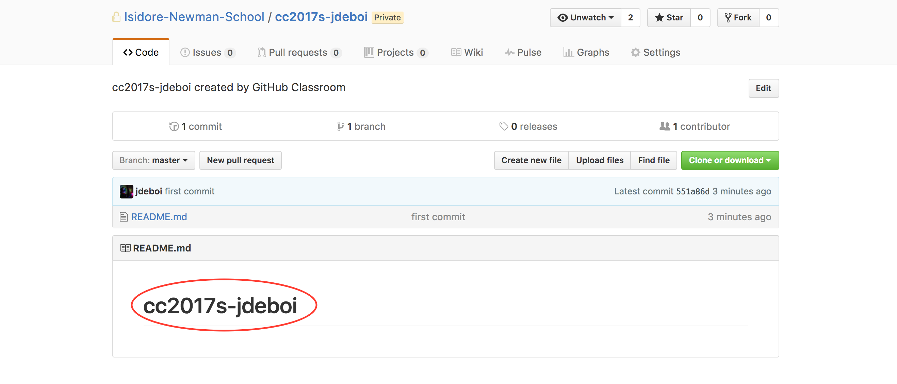

# Git 2. Cloning Your Repo

This section covers submitting to GitHub for the first time. Each student was assigned a private repository (repo). When students save work in this repo locally (on their computers) and subsequently "push" it to GitHub, Ms. deBB will be able to see the submitted assignment.

## Navigate to local directory

In Git for Windows (or in a terminal window if you're on Mac OS/ Linux) navigate to the folder *on you computer* where you'd like the local copy of your repository to live.

1. If you don't already have a *Creative Coding* folder on your computer, create it now.
2. Change into that directory.

If you'd like your GitHub repo to be saved in the "Coding" folder, cd to this directory:

```bash
cd /Users/[jennadeboisblanc]/Documents/Coding
```

## Finding your online repo

You should have automatically created your online GitHub repo by clicking on a link on the class iNewman page. Your repo should be something like, `ccs2017-jennadeboisblanc`. To find it:

  1. Go to [Isidore Newman Repositories page](https://github.com/Isidore-Newman-School)
  2. Search/ look for `cc2017s-[your name]` and click on it

## Clone GitHub Repo

* To make a local copy of this online repo, follow the instructions to **create a new repository on the command line** by *copying that code in the red box below* and pasting it into your terminal.

  


We will discuss these commands in the next section. For now, just know that you created a README.md file with the heading "# your-repo", initialized a local git repo, and subsequently pushed this local repo to GitHub.

## If everything worked...
You should now have:

1. a README.md file on your computer in your coding folder
2. a README.md online with the heading, `ccs2017-[your username]` when you refresh the page of the of online repo. E.g.:




---
[<- Git 1. Command Line Basics](1_commandLine.md) | [Git 3. Submitting Assignments ->](3_submitting.md)
