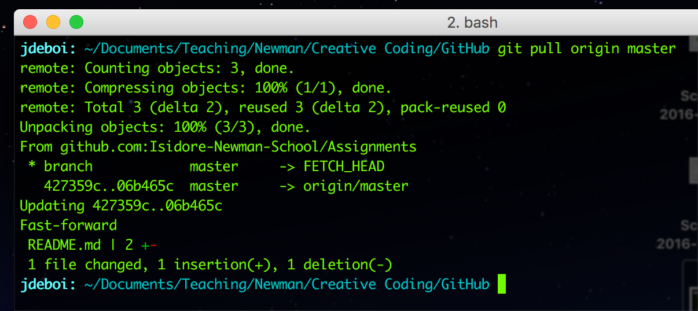
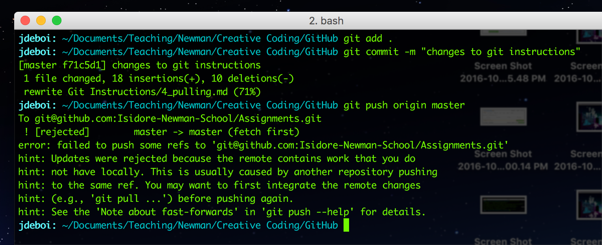
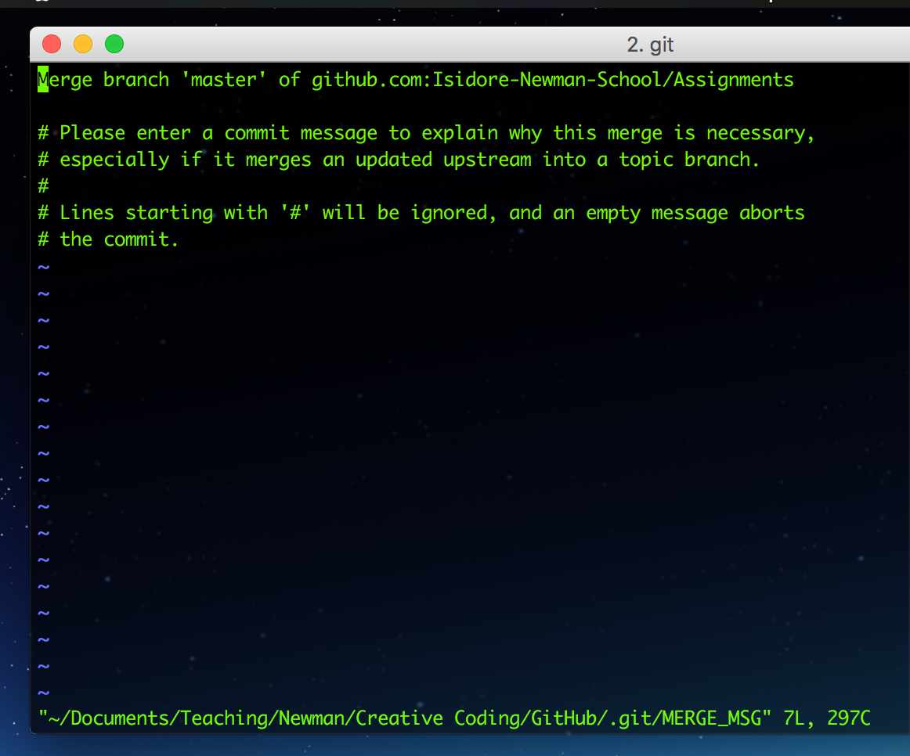
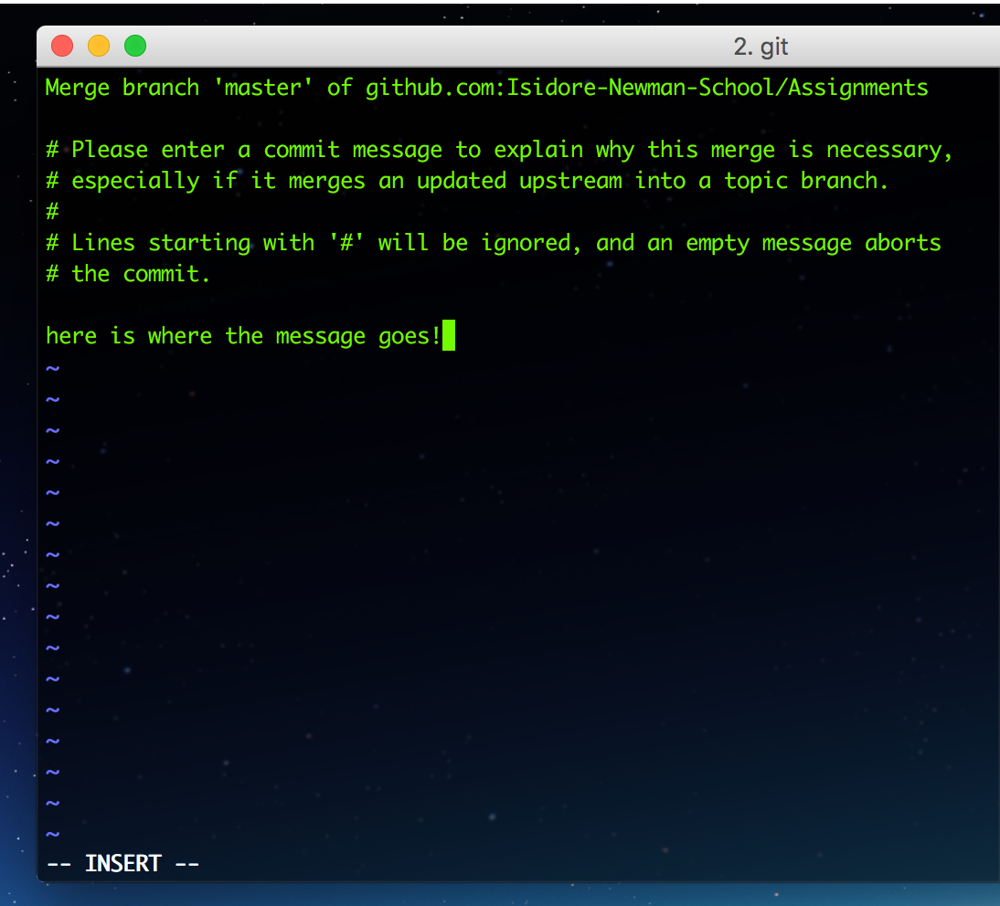
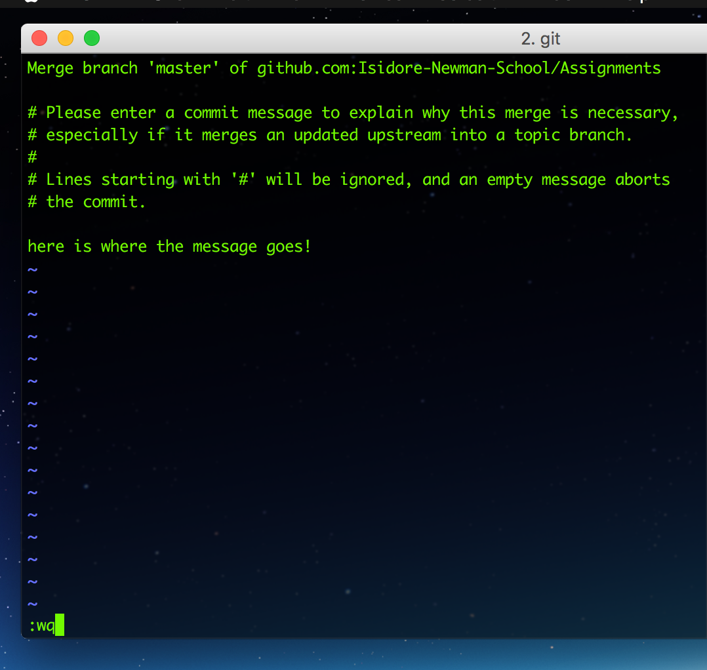

# Git 4. Pulling

**NOTE** [A video from our man Dan](https://www.youtube.com/watch?v=yXT1ElMEkW8&index=6&list=PLRqwX-V7Uu6ZF9C0YMKuns9sLDzK6zoiV)

After you've submitted your assignments to GitHub by pushing to your remote repository (i.e. online folder), I will be able to see and grade your work. You will be able to **see your grades online** if you navigate to your online GitHub repo.

## Pulling changes
To see the changes I make locally, you will have to `pull` these changes into your *local* repository. If you haven't made any changes / commits since I graded your assignments, change into the correct directory and type:

```git
git pull origin master
```




## Pulling before pushing

When attempting to push changes to GitHub you may see the following error message, indicating that I've made changes on your online repo. Before you can push, you must pull.




Type `git pull origin master`.


If Vim is your default editor (most likely), you will be prompted to commit a message after pulling in the changes. Vim (a terminal editor) will pop up.



Type:
  1. **i** (gets you into insert mode)
  2. type a commit message
  3. **ESC**  (to get out of insert mode)
  4. **:wq** (to quit and save)





When you save and close out (with :wq) of Vim, the pull is complete. You can now push your changes.
