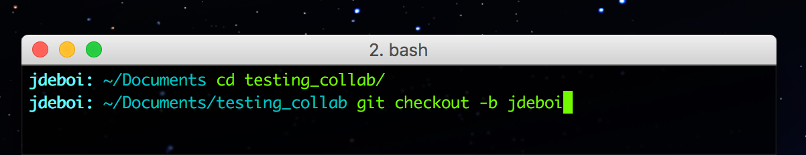
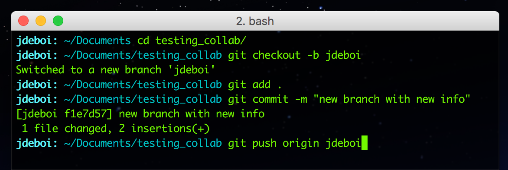

# Git 5. Collaborating

**NOTE**: [A video from our man Dan](https://www.youtube.com/watch?v=_NrSWLQsDL4&list=PLRqwX-V7Uu6ZF9C0YMKuns9sLDzK6zoiV&index=3)

This guide will walk you through the steps of editing a partner's code (submitting a "pull request"), as well as incorporating another student's changes into your own code.

## Fork
Forking is a process of creating an identical copy of someone else's repo on your own GitHub account. Begin by navigating to the URL of your partner's repo (or the repo you'd like to collaborate on), and click the **fork** button:


You should now have a forked copy of the repo associated with your own GitHub account:


## Clone
Once you've forked the repo, you need to create a local version (on your computer) of these files so that you can modify them. Open the terminal / Git Bash. Begin by changing into (cd) the directory where you'd like the repo to live. Then use the clone command with the URL provided in the clone drop down:

```git
git clone git@github.com:Isidore-Newman-School/testing_collab.git
```


## Branches
Watch the first ~4 minutes of [Daniel Shiffman's video on branches](https://www.youtube.com/watch?v=oPpnCh7InLY).

The gist is that we're going to create a branch on this forked repo, make changes, and push this new branch back to the original owner. Creating branches on the forked repo, rather than simply modifying the main or "master" branch, is best practice when collaborating.

Let's create a new branch so that we can modify the forked code and subsequently push it back to your partner. Change into the directory where your local cloned repo is, and issue the following command:

 ```
 git checkout -b add-your-name
 ```

 


## Modify, Commit, Push
Now it's time to modify your partner's code, and push it back online in the same process you've used to get your code online on GitHub. **The only difference** is that you'll push to the branch (whatever you named it) instead of "master."

```git
git push origin jdeboi
```



## Pull Request
A pull request is when you request that the original programmer (e.g. your partner) incorporate the changes you've made by pulling them into his or her original repo.

Go online to GitHub and find the page of your *forked* repo (which should now be modified and have a new branch). Click on the "Compare and pull request" button


Type a detailed message so that your partner knows what you changed and why.


Congrats! You've submitted a pull request!

[Source](https://www.thinkful.com/learn/github-pull-request-tutorial/#Time-to-Submit-Your-First-PR)
