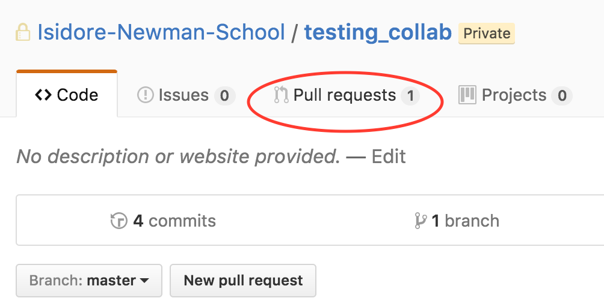
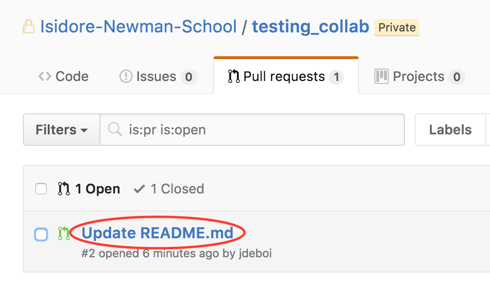
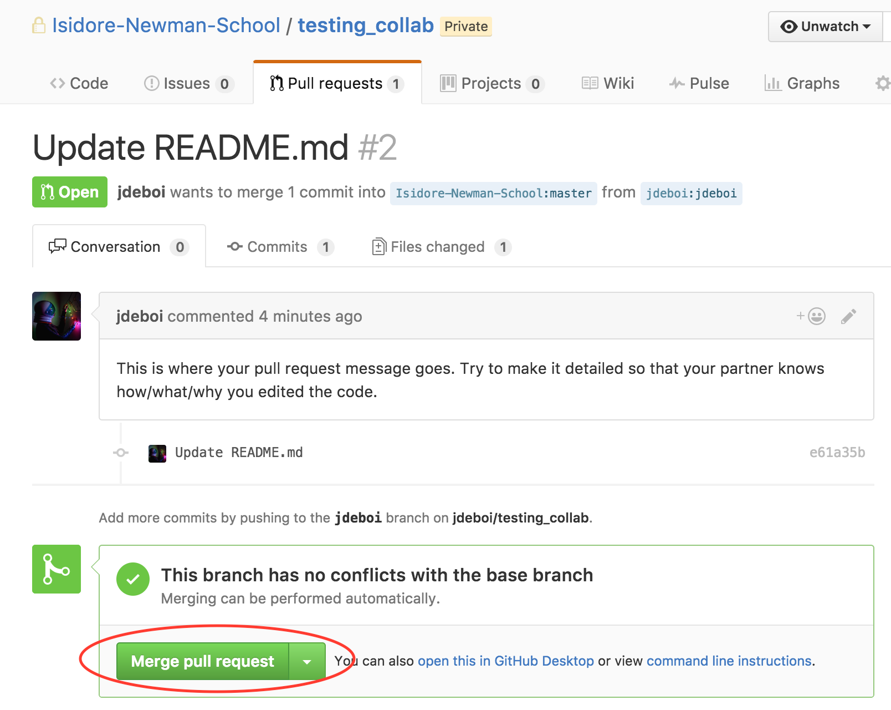

# Git 6. Merging

## Merge Pull Request
Your partner just submitted a "pull request" on your repo; they've modified your code and want you to incorporate their changes into your repo.

Got to your repo and click on "Pull requests."

Click on the pull request that you'd like to incorporate.

Finally, click "merge pull request," type in a commit message, and click commit! You're done!

If this button isn't available (if, for example, you've modified your code since they submitted the pull request and "This branch has conflicts that must be resolved"), consult the internet!

[Source](https://help.github.com/articles/merging-a-pull-request/)
