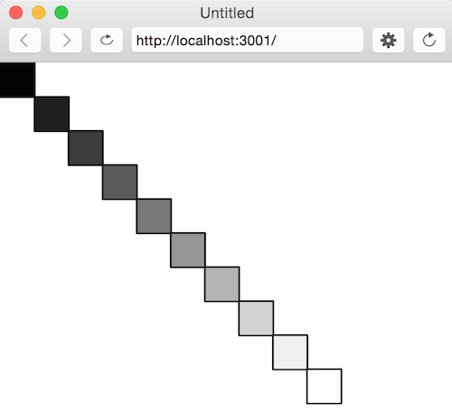

# Homework 0. SOLUTIONS 
### Variables, Functions, Conditionals, Loops

## Variables

**(1)** In the following code, what is printed to the console? For the quiz, be prepared to answer this type of question with pencil and paper. (Pro tip: create a table and use it to track the values of x and y at each line of code) 

```javascript       
var x = 5;              // x        y
var y = 1;              // 5        1
x = x + x + y;          // 11       1
y = x * 2;              // 11       22       
x = 5;                  // 5        22
y++;                    // 5        23
console.log(x + y);     // = 28    
```


**(2)** So far we've looked at three types of variables: numbers (-13.7), strings ("hello!"), and booleans (true/ false). Give 2 examples of built-in p5 variables that are numbers and 2 built-in p5 variables that are booleans. (Hint: check the "Events" section of the [reference page](https://p5js.org/reference/#group-Events))

* mouseX, mouseY = number variables
* keyIsPressed, touchIsDown = booleans


## Functions

**(3)** Write a function **madLib()** that takes 4 strings (noun, adjective, verb, noun), creates a story, and prints the story to the console.

``` javascript
function draw() { 
    madLib("Darth Vader", "smelly", "slide", "karate");
}

function madLib(noun1, adjective, verb, noun2) { 
   console.log(noun1 + " was " + adjective + 
      " so Luke wanted to " + verb + " but instead he did " + noun2);   
}                                      
```

**(4)** Write a function **square()** that takes a single argument and *returns* the square of that number.

```javascript
function square(x) {
  return x * x;
}
```

## Conditionals

**(5)** Write a function **myNameIsBetter()** that takes an argument and checks if it's equal to your name. If so, it prints to the console, "We have the same name!!" Otherwise, it prints, "[your name here] is cooler than [input name here]".


```javascript
function myNameIsBetter(name1) { 
   if (name1 == "Jenna") {                        
      console.log("We have the same name!!");
   } else {                                   
      console.log("Jenna is cooler than " + name1);
   }                                       
}                                              
```

## Loops

**(6)** Use a for loop to create the following image. Try to use variables rather than numbers. The exact size isn't necessary (I'm looking for conceptual understanding).



There are a couple of solutions, but here's what I did:

```javascript
function draw() { 
   for (var i = 0; i < 10; i++) {
      fill(i*25);
      rect(i*30, i*30, 30, 30); 
   }
}
```


