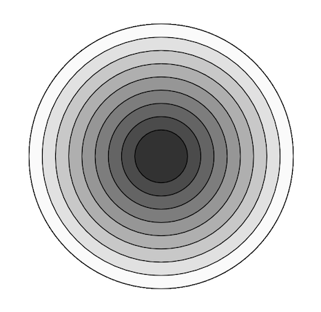

# Homework 0_2.
### Variables, Functions, Conditionals, Loops

To submit this assignment:
* You may submit answers using text files, p5 projects, or README.md.
* Save your document(s) in a folder **HW0_2, which should be a subdirectory of your Git repo.**
* Make sure you have **pushed your Git repo to GitHub**.
* To review submitting assignments via GitHub, checkout [Git Instructions](https://github.com/Isidore-Newman-School/Creative-Coding-F2016/tree/master/Git%20Instructions)

## Variables

**(1)** In the following code, what is printed to the console? For the quiz, be prepared to answer this type of question with pencil and paper. (Pro tip: create a table and use it to track the values of x and y at each line of code)

```javascript
var x = 2;       
var y = 3;        
x = (x * 3) - y;  // x = (2 * 3) - 3 = 3
y = x + x;        // y = 3 + 3 = 6
x--;              // x = 2
y++;              // y = 7
console.log(x + y); // 9
```

**(2)** So far we've looked at three types of variables: numbers (-13.7), strings ("hello!"), and booleans (true/ false). Give 1 example of a built-in p5 variable in the **"environment"** section of the p5.js [reference page](https://p5js.org/reference/) that is a number and 1 built-in p5 variable that is a boolean.

* width - number
* focused - boolean


## Functions

**(3)** Write a function **bandNameGenerator()** that takes 3 string arguments (adjective, verbEndingWithING, pluralStarWarsNoun), concatenates the arguments, and prints to the console, "Your rad band name is [insert band name here]."


```javascript
function draw() {
  bandNameGenerator("Awesome", " Roaring", " Chewbaccas");
}

function bandNameGenerator(adjective, verb, noun) {
    console.log("Your rad band name is " + adjective + verb + noun);
}
```

**(4)** Write a function **cube()** that takes a single argument and *returns* the cube of that number.

```javascript
function draw() {
    console.log(cube(3));
}

function cube(x) {      
    return x*x*x;
}
```

## Conditionals

**(5)** In computer science the "%" (a.k.a. the modulo operator) is surprisingly useful. It is used to calculate the *remainder* after dividing two numbers. E.g.:

    5%2 = 1;
    4%2 = 0;
    3%2 = 1;
    2%2 = 0;
    1%2 = 1;
    0%2 = 0;

Write a function **isEven()** that takes an argument and checks if it's even. If so, it prints to the console, "[insert number here] is even!" Otherwise, it prints, "[insert number here] is odd!"

```javascript
function isEven(val) {
    if (val%2 === 0) {
        console.log(val + " is even!");
    }
    else {
        console.log(val + " is odd!");
    }
}
```

## Loops

**(6)** Use a for loop to create the following image. Try to use variables rather than numbers. The exact size isn't necessary (I'm looking for conceptual understanding).

Hint: Break this problem down into discrete steps. If you're struggling, come talk to Ms. deBB!



```javascript
function draw() {
    for (var i = 0; i < 10; i++) {
        fill(255 - i*25);
         ellipse(width/2, height/2, 200 - i*20, 200 - i*20);
   }
}
```
