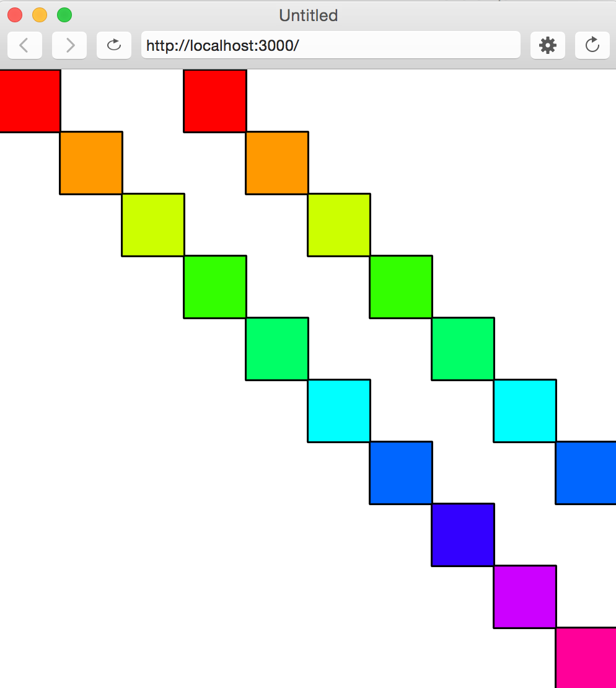

# Homework 0_3.
### Variables, Functions, Conditionals, Loops

## Variables

**(0)** The variable *address* (below) is what type of variable?

```javascript
var address = "I used to live on " + 27 + " Heron St. That is " + true;
```

1. string
2. number
3. boolean
4. all of the above
5. none of the above

**Hint:** What does the following line of code print?
```javascript
console.log(typeof 10);
```

## Functions
**(1)** Write a function, **getDiceRoll()**, that *returns* a random number from (and including) 1 to 6.

```javascript
function setup() {
  createCanvas(500, 500);
}

function draw() {
  var roll = getDiceRoll();
  console.log(roll);   // prints random number 1, 2, 3, 4, 5, or 6
}

function getDiceRoll() {
  // your code here
}

```

## Conditionals
**(2)** Write a function, **checkRoll()**, that takes two arguments: roll 1 and roll 2.
* If the rolls are equal, print to the console, "Doubles! [insert the number] must be lucky!"
* If not, if the sum of the numbers is greater than or equal to 8, print to the console, "[insert sum] is a high roll!"
* Otherwise, calculate the bigger number and print, "[insert bigger number] is your highest roll."


```javascript
function setup() {
  createCanvas(500, 500);
}

function draw() {
  var roll1 = getDiceRoll();
  var roll2 = getDiceRoll();
  console.log("-----------------");
  console.log("You rolled: " + roll1 + " and " + roll2);
  checkRoll(roll1, roll2);
  console.log("-----------------");
}

function checkRoll( /* your code here */ ) {
  // your code here
}

```

## Loops
**(3)** Fill out the function, **doubleRainbow()**. Use a single for loop to create the following image:

```javascript
function setup() {
  createCanvas(500, 500);
  colorMode(HSB, 10);
}

function draw() {
  doubleRainbow();
}

function doubleRainbow() {
  // your code here
}
```

