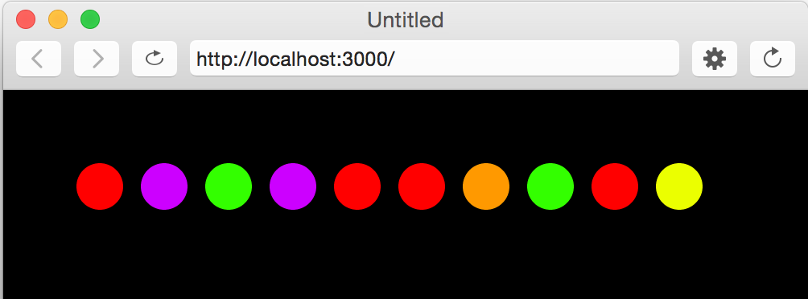
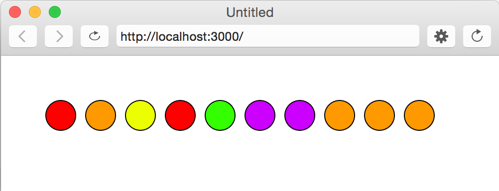

# Homework 1_2.

## Arrays
**(1)** Write a function **getLastElement()** that takes an array as an argument and *returns* the last element. If the array is empty, return -1.

```javascript
function draw() {
    console.log(getLastElement([1, 0, 1, 2, 3]));  // prints 3
    console.log(getLastElement([]));  // prints -1
}

function getLastElement( /* your code here */) {
  // your code here
}
```
---

**(2)** Write a function, **findItem()**, that takes two arguments:

1. an array
2. an item to look for in the array

The function *returns* the number of times that particular item shows up in the array. For example, if we're looking for "gold":

```javascript
function draw() {
    console.log(findItem([1, true, "gold", -1, "gold", 10], "gold"));   // prints 2
    console.log(findItem(["silver"], "gold"));   // prints 0
}

function findItem(/* your code here */) {
  // your code here
}
```

---

**(3)** The *skittles[]* array is filled with 10 hues randomly selected from the *skittleHues[]* array.

1. Inside the **drawSkittles()** function, use the *skittles[]* array to draw 10 skittles (see the image below).
2. Use the **findItem()** function to get the number of red skittles in the *skittles[]* array. If there are more than 3 red skittles, make the background black. Otherwise, make the background white.

```javascript
// hues: red, orange, yellow, green, purple
var skittleHues = [0, 10, 18, 30, 80];
var skittles = [];

function setup() {
  createCanvas(500, 500);
  colorMode(HSB, 100);

  // setting skittles[] to random skittle hues
  for (var i = 0; i < 10; i++) {
     skittles[i] = skittleHues[Math.floor(random(5))];
  }
}

function draw() {
  // background code goes here
  drawSkittles();
}

function drawSkittles() {
  // draw 10 circles with hues from skittles[]
}
```




