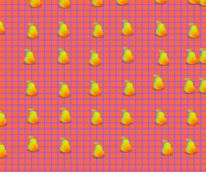
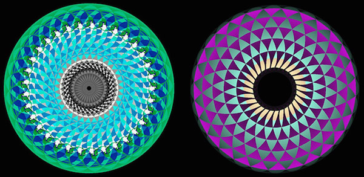

#Project 1: p5.js Interactivity

In Project 1 students will demonstrate proficiency with JavaScript fundamentals and the p5.js library by developing interactive, single-page websites. Students can draw inspiration from sites such as:

* [The p5 gallery](https://p5js.org/gallery/)
* The bizarre (and usually funny) site, [theuselessweb.com](https://theuselessweb.com)
* [100 Days of Click Art](http://leslieruckman.tumblr.com/)

[Leslie Ruckman](http://leslieruckman.tumblr.com/)

## Requirements
At least one instance of the following components must be used (not just declared) in your code:

* Interactivity (keyboard, mouse, etc.)
* Boolean, string, and number variables
* Conditional logic (if/else)
* loop (for, while, etc.)
* array
* Uniquely defined function that takes one or more arguments
* Uniquely defined function that returns a value
* Uniquely defined object

## (Optional) Challenges
For experienced students who are interested in taking this project to the next level, consider incorporating one or more of the following elements:

1. An Arduino that links physical, real-world stimuli to p5.js. Additional info here: [https://itp.nyu.edu/physcomp/labs/labs-serial-communication/](https://itp.nyu.edu/physcomp/labs/labs-serial-communication/lab-serial-input-to-the-p5-js-ide/)
2. [Additional libraries](https://p5js.org/libraries/) for face recognition, geolocation, and more!
3. The [p5.sound library](https://p5js.org/libraries/) for music visualizers or triggering sounds:
4. A particle system with that exhibits flocking, swarming, etc. behavior.
5. A game (Pong, Snake, etc.)!

## Evaluation
The following criteria are used to evaluate creative assignments:

* **Meets Requirements**: Does the project follow directions and fulfill all aspects of the assignment? Are materials turned in on time?
* **Correctness**: To what extent is your code free of bugs?
* **Design and Style**: To what extent is your code written well (i.e., clearly, efficiently, elegantly, and/or logically)? To what extent is your code readable (i.e., commented and indented with variables aptly named)?
* **Creativity**: To what extent is the project unique, inventive, and imaginative?
* **Effort**: Is there evidence that you invested time and energy in the project?

## Plagiarism
In the age of the internet, and particularly in the realm of computer programming, it is very easy to copy/paste code.

**Citing Code**  

Sharing code and building off of previous work is permissible, and even encouraged, so long as:
* The code is open source.
* You give proper credit by including a comment in your code with a URL or clear description of the source code. Credit is also required for “adapted” code.
* The copied/adapted code cannot make up a substantial portion of the project.

**Does NOT need citation:**
* copying snippets from p5.js or homework/ class examples
* easily-derived code (i.e. would it be tedious to write yourself?)
* your own work
