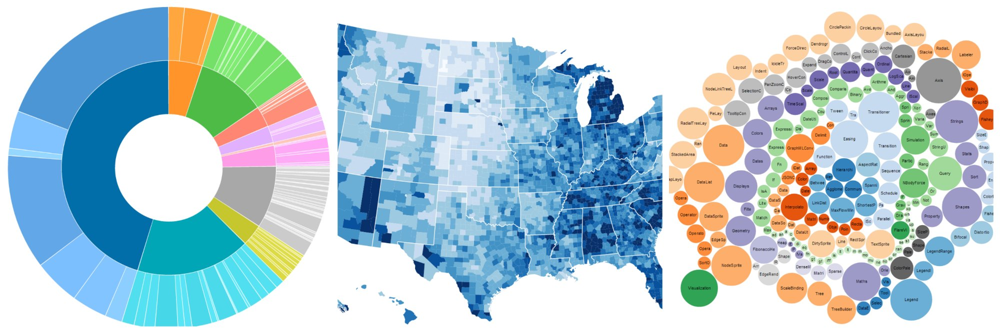

#Project 2: Data Visualization

[Data visualization](https://docs.google.com/presentation/d/1H66LBXGPAt5Xk4jbGseGBHVbbbaJx7Y0apG3ZfqO3dA/edit?usp=sharing) is one component of [Data Science](https://en.wikipedia.org/wiki/Data_science), a burgeoning field in computer science thanks in large part to the rise of [Big Data](https://en.wikipedia.org/wiki/Big_data)- a term referring to the rapid increase of data availability and collection. Graphically displaying information helps to communicate ideas, illuminate trends, and facilitate data analysis, which is why data visualization has applications to almost any imaginable discipline.

In this project, students will create data visualizations on the web using personally-relevant data. Students may use p5.js to create visualizations, but more experienced students are **strongly encouraged to use [D3](https://d3js.org/)**- a powerful JavaScript library designed specifically for data visualization.

--> **p5.js** [**TUTORIALS**](https://www.youtube.com/playlist?list=PLRqwX-V7Uu6a-SQiI4RtIwuOrLJGnel0r) from our man Dan (:blush:).


[](https://d3js.org/)

## Requirements

1. Load data set(s)
  * p5.js:
    * [loadTable()](https://p5js.org/reference/#/p5/loadTable)
    * [loadJSON()](https://p5js.org/reference/#/p5/loadJSON),
    * [loadStrings()](https://p5js.org/reference/#/p5/loadStrings), or
    * [loadXML()](https://p5js.org/reference/#/p5/loadXML)
    * Also [p5 data reference](https://github.com/processing/p5.js/wiki/Loading-external-files:-AJAX,-XML,-JSON)
  * D3: [csv/tsv, JSON, HTML, text, XML](https://github.com/d3/d3/blob/master/API.md#requests-d3-request)
  * Experienced students: maybe check out an [API like NYT's](http://developer.nytimes.com/)?
2. Data visualization
  * Bar graph, line graph, scatter plot, heat map, or any other form of communicating data!
  * Emphasis on *communicating relevant trends or ideas*
3. Data analysis
  * Must perform a meaningful operation on the data set such as:
    * **average, median, or mode** (e.g. what is the average sentence in years for black men and white men who commit the same crime?)
    * **aggregate** (e.g. how many times does the word "huge" show up in Trump's latest speech?)
    * **max/ min** (e.g. what is the most emojis a politician has put in a single tweet?)
    * for statistics gurus: **variance** ([D3 has a function](https://github.com/d3/d3-array/blob/master/README.md#variance)...)
    * **or something else**! Feel free to explore.
4. Git collaboration
  * Must submit a meaningful [pull request](https://www.youtube.com/watch?v=oFYyTZwMyAg) on another student's work
  * Must incorporate a pull request into your own work
5. HTML
  * Review the [HTML page](../Classwork/html.md)
  * Must include the following tags:
    * heading - ```<h1>title of page / visualization</h1>```
    * paragraph - ```<p>Info about the data visualization</p>```
    * link to your original data - ```<a href="...">click me for data source</a>```
6. CSS
  * Review the [CSS page](../Classwork/css.md)
  * Include an external CSS document that includes styles for:
    * the margins of the body
    * the color/ font/ etc. of the heading


## Evaluation
The following criteria are used to evaluate creative assignments:

* **Meets Requirements**: Does the project follow directions and fulfill all aspects of the assignment? Are materials turned in on time?
* **Correctness**: To what extent is your code free of bugs?
* **Design and Style**: To what extent is your code written well (i.e., clearly, efficiently, elegantly, and/or logically)? To what extent is your code readable (i.e., commented and indented with variables aptly named)?
* **Creativity**: To what extent is the project unique, inventive, and imaginative?
* **Effort**: Is there evidence that you invested time and energy in the project?

## Plagiarism
In the age of the internet, and particularly in the realm of computer programming, it is very easy to copy/paste code.

**Citing Code**  

Sharing code and building off of previous work is permissible, and even encouraged, so long as:
* The code is open source.
* You give proper credit by including a comment in your code with a URL or clear description of the source code. Credit is also required for “adapted” code.
* The copied/adapted code cannot make up a substantial portion of the project.

**Does NOT need citation:**
* copying snippets from p5.js or homework/ class examples
* easily-derived code (i.e. would it be tedious to write yourself?)
* your own work
