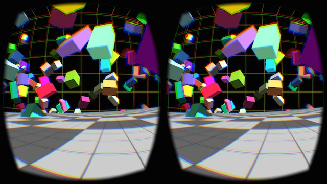

# Project 3: Virtual Reality

In the third and final project students will develop virtual reality apps for the web that can be viewed using Google Cardboard. This project relies on [three.js](https://threejs.org/examples/), a JavaScript library designed for 3D graphics.

**---> To get started**, begin by [cloning the VR_example repo](https://github.com/Isidore-Newman-School/VR_example). 

#### Potential ideas:
* Scenes
  * Aquarium or underwater scene
  * Alien planet
  * Outdoor terrain
* Display 3D models
  * 3D walk through of a building modeled with your favorite CAD software
  * Gallery/ museum of 3D Pokemon
  * Chess set made up of 3D scans of students
* Abstract art
* Games: pong, snake, asteroids, etc.
* 3D visuals that accompany music

Check the [three.js examples](https://threejs.org/examples/) or [Mozilla VR](https://mozvr.com/#showcase) for more ideas.

## Requirements
1. Variety of 3D shapes/ objects
2. Camera controls - i.e. must be able to move around and view the scene
3. Moving objects - e.g. shooting stars, rotating planets, bouncing balls, etc.

## Evaluation
The following criteria are used to evaluate creative assignments:

* **Meets Requirements**: Does the project follow directions and fulfill all aspects of the assignment? Are materials turned in on time?
* **Correctness**: To what extent is your code free of bugs?
* **Design and Style**: To what extent is your code written well (i.e., clearly, efficiently, elegantly, and/or logically)? To what extent is your code readable (i.e., commented and indented with variables aptly named)?
* **Creativity**: To what extent is the project unique, inventive, and imaginative?
* **Effort**: Is there evidence that you invested time and energy in the project?

## Plagiarism
In the age of the internet, and particularly in the realm of computer programming, it is very easy to copy/paste code.

**Citing Code**  

Sharing code and building off of previous work is permissible, and even encouraged, so long as:
* The code is open source.
* You give proper credit by including a comment in your code with a URL or clear description of the source code. Credit is also required for “adapted” code.
* The copied/adapted code cannot make up a substantial portion of the project.

**Does NOT need citation:**
* copying snippets from p5.js or homework/ class examples
* easily-derived code (i.e. would it be tedious to write yourself?)
* your own work
