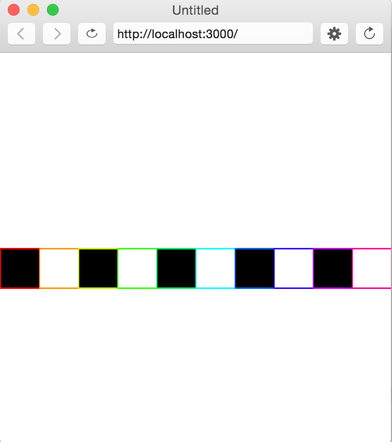

# Quiz 0.
### Variables, Functions, Conditionals, Loops

## The following should be completed with pencil and paper

**(1)** In the following code, what is printed to the console?  

```javascript
var x = 4;
var y = 2;
var z = x + y;
x = x + x + z;
y = z * 2;
z--;
console.log(x + z - y);
```

**(2)** What are the three types of variables we've explored so far?

---


## The following can be completed in P5 (no internet)

* Create a "Quizzes" folder inside your repo and save Quiz0 inside this folder.
* To submit your quiz, push the changes to GitHub. Let me know if you have problems.

**(3)** Write a function, **didGreeniesWin()**, that takes three arguments- Newman's opponent, Newman's score, and the opponent's score. If Newman won, print to the console, "Greenies are victorious!". If the Greenies tied, print "Greenies tied with [insert opponent]." Otherwise print, "Sad day indeed. [Insert opponent] won."

```javascript
function setup() {
  createCanvas(400, 400);
}

function draw() {
  didGreeniesWin("Pope John Paul II", 21, 14);
  didGreeniesWin("Jesuit", 3, 40);
}

function didGreeniesWin( /* code here */) {
   // your code here
}
```

**(4)** Write a function, **sumRange()**, that takes two arguments- a start and an end- and *returns* the sum of the range beginning with the start and (including) the end.

```javascript
function setup() {
  createCanvas(400, 400);
}

function draw() {
  console.log(sumRange(1, 3));  // prints 6 = 1 + 2 + 3
}

function sumRange(/* your code here */) {
    // your code here
}
```


**(5)** Write a function, checker(), that uses a for loop and conditional logic to create the following image:

```javascript
function setup() {
  createCanvas(400, 400);
  colorMode(HSB, 10);
}

function draw() {
  checker();
}

function checker() {
   // your code here
}
```

        
